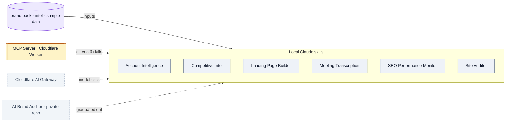

# marketing-agents — system overview

*A public monorepo of GTM agents built as Claude Code skills, each replacing a paid SaaS tool. Almost all run locally as skills; one Cloudflare Worker redistributes a subset over MCP.*

## Flow

**Legend** (shared across this repo's docs): stadium = trigger · rectangle = process · subroutine = external service · cylinder = data store · parallelogram = output · dashed = cross-repo. Solid arrow = in-system; dashed = cross-repo / async.

## What's inside

The repo is organized around the 4-layer AEO practitioner stack.

| Layer | Agent | Doc |
|---|---|---|
| 1 · search fundamentals | SEO Performance Monitor | [SYSTEM.md](agents/seo-performance-monitor/SYSTEM.md) |
| 1 · search fundamentals | Site Auditor | [SYSTEM.md](agents/site-auditor/SYSTEM.md) |
| 2 · what models say | AI Brand Auditor — now a private repo ([ai-brand-auditor](https://github.com/d-walia/ai-brand-auditor/blob/main/SYSTEM.md)) | — |
| 3 · context + agents | Competitive Intel Researcher | [SYSTEM.md](agents/competitive-intel-researcher/SYSTEM.md) |
| 3 · context + agents | Landing Page Builder | [SYSTEM.md](agents/landing-page-builder/SYSTEM.md) |
| 4 · crawling + processing | Site Auditor `--full-text` corpus → planned Competitor Content Analyzer | — |
| (GTM) | Account Intelligence Agent | [SYSTEM.md](agents/account-intelligence-agent/SYSTEM.md) |
| (GTM) | Meeting Transcription (batch + live) | [SYSTEM.md](agents/meeting-transcriber/SYSTEM.md) |
| (distribution) | MCP Server | [SYSTEM.md](mcp-server/SYSTEM.md) |

## How it runs

Each agent is a folder with a `SKILL.md` front door plus scripts/references, installed by symlinking into `~/.claude/skills/`. The single piece of deployed infra is `mcp-server/` — a Cloudflare Worker that serves three skills over MCP. AI provider calls route through the Cloudflare AI Gateway; transcription uses free Groq Whisper.

## Services & stores

| Thing | Type | Detail |
|---|---|---|
| MCP Server | Service | Cloudflare Worker; serves competitive-intel, meeting-transcriber, live-meeting-transcriber |
| Cloudflare AI Gateway | Service (cross-repo) | Attributable cost for every model call |
| `brand-pack/`, `intel/`, `sample-data/` | Store | Shared support dirs (positioning, competitor baselines, demo data) — not standalone apps |

## Connects to

- [Cloudflare AI Gateway](https://github.com/d-walia/ai-architecture/blob/main/cloudflare-ai-gateway/SYSTEM.md) — the shared spine.
- [AI Brand Auditor (Avowed)](https://github.com/d-walia/ai-brand-auditor/blob/main/SYSTEM.md) — the Layer-2 product graduated to its own private repo; Site Auditor's verdict logic is hand-synced with the Avowed checker.

## Gotchas

- The README's TL;DR says "seven agents" (pipeline count); the `agents/` folder holds eight built (the two transcribers are one two-front-door pair).
- The AI Brand Auditor is referenced throughout but its **code is not in this repo** (moved to the private `ai-brand-auditor`).
- `intel/` and `brand-pack/` are conventions/aspirational today — `intel/` holds only its README; `brand-pack/`'s consumer (a planned Copywriter) isn't built.

## Sources

`README.md`, `.claude/agents/*`, each `agents/*/SKILL.md`, `mcp-server/`
