# Account Intelligence Agent

*Claude drives Clay's web UI through Chrome to build an enriched TAM table: seed list → enrichment waterfalls → Claygent research → contact sourcing → email waterfall.*

## Flow

```mermaid
flowchart LR
  SKILL(["Skill · build an account list in Clay"]):::trigger --> SEED["1 · compile seed CSV company,domain"]:::process
  CSV[("seed-data · 185 health systems")]:::store -->|user drags into Clay| SEED
  SEED --> IMP["2 · import · auto-run OFF"]:::process
  IMP --> ENR["3 · Enrich Company · 10-row test"]:::process
  ENR --> CLAY[["Clay · Enrich · Claygent · Email waterfall"]]:::service
  ENR --> RES["4 · Claygent research columns"]:::process
  RES --> GATE["5 · free ICP-fit formula gate"]:::process
  GATE --> PPL["6 · Find People → linked table"]:::process
  PPL --> MAIL["7 · Work Email waterfall · 10-row test"]:::process
  MAIL --> OUT[/"8 · export views · 185 enriched · 71 RCM contacts"/]:::output
  classDef trigger fill:#dcfce7,stroke:#15803d,color:#0f172a;
  classDef process fill:#eef2f8,stroke:#64748b,color:#0f172a;
  classDef service fill:#fef3c7,stroke:#b45309,color:#0f172a;
  classDef store fill:#ede9fe,stroke:#6d28d9,color:#0f172a;
  classDef output fill:#ccfbf1,stroke:#0f766e,color:#0f172a;
  classDef ext fill:#f1f5f9,stroke:#94a3b8,color:#334155,stroke-dasharray:4 3;
```

## How it runs

A local Claude skill with no scripts — Claude operates Clay's browser UI directly in Dhruv's logged-in session. There is no API: the user drags the seed CSV into Clay's import dialog by hand (the browser sandbox can't upload files). Operating rules enforce credit discipline: check the balance first, keep auto-run OFF, test on a 10-row slice before scaling, filters before waterfalls.

## Services & stores

| Thing | Type | Detail |
|---|---|---|
| Clay (`app.clay.com`) | Service | Via Chrome/browser automation; Enrich Company, Claygent, 11-provider Work Email waterfall |
| `seed-data/health-system-seed-list.csv` | Store | 185 US health systems (`company_name`, `domain`, `state`, `type`) |
| Clay workspace tables | Store | Output lives in Clay, not the repo |

## Connects to

- Standalone — not wired to other agents. First vertical is healthcare RCM sales; designed to adapt to new verticals.

## Gotchas

- Outputs (185 enriched, 71 RCM contacts, export views) live in the **Clay workspace, not the repo** — the reported counts are first-run results, not verifiable from files.
- No API keys and no AI Gateway — everything runs inside Clay's UI.

## Sources

`SKILL.md`, `README.md`, `seed-data/health-system-seed-list.csv`
