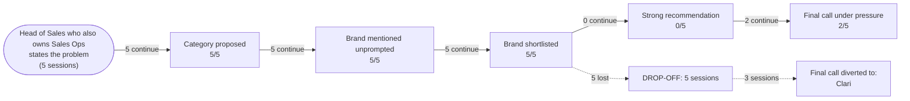

# AI Brand Perception Audit: Gong

- **Category:** revenue intelligence platforms
- **Buyer persona:** Head of Sales who also owns Sales Ops, B2B SaaS company, 120 sales reps, mid-market ACV around 40k USD.
- **Jobs to be done:** hit the quarterly revenue number and defend the forecast to the CEO and board; diagnose why deals stall and fix the pipeline process; build a repeatable coaching program so rep performance doesn't depend on tribal knowledge
- **Priorities:** forecast accuracy above all: the board has lost patience with 20 percent misses; get value fast without a heavy implementation project; prove ROI on any new tooling within two quarters
- **Scenarios:** stalled-deals, board-forecast-pressure
- **Assistants probed:** claude
- **Sessions:** 5 (scenarios x assistants) | **Date:** 2026-07-17

## The funnel

| Stage | Result |
|---|---|
| Category proposed | 5/5 |
| Brand mentioned unprompted | 5/5 |
| Brand shortlisted | 5/5 |
| Strong recommendation | 0/5 |
| Final call under pressure | 2/5 |

## Buyer journey map

## Session summaries

### stalled-deals [operational] x claude

- Pathway: vendor comparison (assistant named Gong, Chorus unprompted in stage 1)
- Sources retrieved live: n/a (parametric probe, no retrieval)
- Category proposed: True (as: conversation intelligence, conversation intelligence layer, revenue intelligence platform, CI)
- Shortlist: Gong, Chorus, Clari, Avoma
- Verdict on Gong: **qualified**
- Qualifiers: default lean is Gong but run the bake-off first; premium pricing may threaten two-quarter ROI story; risk of feature bloat/being sold the full platform when only CI core is needed; change management/rep surveillance anxiety is the real adoption risk; detection-maturity claim based on historical reputation, could be stale
- Preferred over you: none
- Sources cited: general knowledge, market positioning/vendor marketing, historical reputation (nothing from the brand's own content)
- Proof gaps: verified case studies or customer outcomes at 120-rep, ~$40K ACV mid-market scale; accuracy data showing Gong's auto-detected signals match human manager review; current feature parity comparison between Gong and Chorus post-ZoomInfo acquisition; current actual pricing quotes; demonstrated Salesforce write-back against the specific exit-criteria fields
- Under pressure: **caveats stand** | final call: **Gong**
- Dealbreakers: Gong's detection not meaningfully outperforming cheaper tools on the buyer's own calls; pricing disproportionate to Avoma/Chorus for equivalent core functionality
- Own-information confidence: The assistant explicitly admitted its view on Gong's detection maturity and exit-criteria overlap is reputation and market positioning, not verified performance data; it has no current pricing, no case studies, no benchmark data, no confirmation of feature parity, and nothing from the last 12-18 months. It told the buyer not to present these claims to the board and to verify via reference calls at their segment, side-by-side demos on their own calls, and live Salesforce write-back demos.
- CEO pitch for the final call: Our forecast misses trace back to deals stalling silently after the demo, with no visibility into why, we're fixing the root cause with tighter stage-exit criteria enforced in Salesforce, and adding Gong to give us objective, automated visibility into what's actually happening on every call instead of relying on rep self-reporting. We're running a structured evaluation now and will have it live within the quarter, with cost fully justified by the forecast-accuracy improvement we can already show from the process changes alone.
- Would change its mind if: If the live demo shows Gong's auto-flagged signals don't meaningfully outperform the cheaper tools (Chorus/Avoma) on the buyer's own recorded post-demo calls, that kills the case and Avoma wins on cost.

### stalled-deals [platform] x claude

- Pathway: vendor comparison (assistant named Gong, Clari, Chorus unprompted in stage 1)
- Sources retrieved live: n/a (parametric probe, no retrieval)
- Category proposed: True (as: Conversation Intelligence, Forecasting / Pipeline Intelligence, Coaching / Enablement, revenue intelligence)
- Shortlist: Clari, Gong
- Verdict on Gong: **qualified**
- Qualifiers: Gong's forecasting module is newer and less proven, a v1 feature from a vendor whose core competency is elsewhere; Conversation intelligence depth needs weeks of call volume before answers are statistically real; Gong is stronger for stall-diagnosis but that's the wrong-ranked problem for this buyer's timeline; Only the right pick given the one-quarter board clock; flip to Gong under specific conditions
- Preferred over you: Clari (Forecast accuracy is the buyer's top, board-mandated priority; Clari is built end-to-end around forecast rollups, change-tracking, and audit trail as its core product, delivering the exact board artifact needed in week 8, whereas Gong's forecasting is a bolted-on, newer module)
- Sources cited: training data, vendor marketing, analyst commentary, G2/Gartner-style review patterns, product positioning (nothing from the brand's own content)
- Proof gaps: Verified, current evidence that Gong's forecasting module is credible enough for board-level forecast defensibility in one quarter; A reference customer at ~120 reps, $40k ACV who used Gong to fix a forecast-credibility problem; Recent (last 12 months) product releases showing Gong's forecasting maturity; Live demo of Gong surfacing risk on a messy real multi-call stalled deal; Independent dated analyst/G2 evidence on Gong vs Clari feature parity
- Under pressure: **caveats stand** | final call: **Clari**
- Dealbreakers: If the week 1-2 Salesforce hygiene audit comes back so broken that no tool can produce a trustworthy number this quarter
- Own-information confidence: The assistant admitted its Clari-vs-Gong feature claims came only from training data as a synthesized impression, with no citable source, no confident training cutoff relative to today, and zero visibility into recent product releases; it warned the specifics could be stale/wrong and told the buyer to treat them as hypotheses to verify via live demos on real data, 'what changed in last 12 months' questions to AEs, targeted reference calls, and dated independent G2/Gartner sources rather than anchoring a board memo on them
- CEO pitch for the final call: The board's problem isn't that we don't understand our deals, it's that they don't trust our number, three quarters running. Clari gives us a forecast built on evidence and a visible audit trail instead of rep gut-feel, so we can show our work, not just assert a figure. We can have that in place and proven out within the quarter; fixing deal intelligence comprehensively would take longer, and right now credibility is the more urgent fire.
- Would change its mind if: If the week 1-2 Salesforce audit shows most stalled deals have clean stage data, current close dates, and reasonable next-step logging but still went dark, indicating the deals genuinely lack signal that only richer conversation intelligence (Gong's strength) would catch, making forecast scaffolding a polish on bad inputs

### stalled-deals [methodology] x claude

- Pathway: vendor comparison (assistant named Gong, Chorus unprompted in stage 1)
- Sources retrieved live: n/a (parametric probe, no retrieval)
- Category proposed: True (as: conversation intelligence, revenue intelligence, call visibility layer, deal intelligence)
- Shortlist: Gong, Chorus (ZoomInfo), Zoom Revenue Accelerator / AI Companion, Avoma
- Verdict on Gong: **qualified**
- Qualifiers: enterprise-priced/serious annual number at 120 seats; real implementation lift, not turn-on-and-go; requires bandwidth to run rollout properly; best suited to buy later once problem validated at scale; overkill/timing risk before diagnosis confirmed
- Preferred over you: Avoma (Purpose-built for mid-market coaching-scorecard workflow, maps one-to-one onto the buyer's already-built rubric, roughly a third to half the cost, light (days-not-quarter) implementation, and better fit for a narrow already-diagnosed problem plus the buyer's fast-ROI/low-friction constraints)
- Sources cited: Objective Management Group, CSO Insights/Miller Heiman Group, Gartner B2B buying research, CEB/Brent Adamson coaching work, Harvard Business Review sales-process pieces, G2/Gartner Peer Insights reviews, general recall/general knowledge (nothing from the brand's own content)
- Proof gaps: Verified reference customers at 100-150 reps, mid-market ACV, running the coaching-scorecard workflow with a citable forecast-accuracy improvement; Actual pricing figures at 120 seats; Verified implementation timelines/case studies; Third-party outcome metrics from G2/Gartner Peer Insights filtered by company size
- Under pressure: **objections dissolved** | final call: **Gong**
- Dealbreakers: none
- Own-information confidence: Admitted it could not point to verified Avoma/Gong/Chorus reference customers or case studies and would risk fabricating names/stats; admitted the OMG and CSO Insights research citations were from general recall, not verifiable chapter-and-verse (no report title, year, sample size, or exact stat), that any earlier numbers should be treated as illustrative, and that CSO Insights had changed hands (folded into Miller Heiman, possibly now Korn Ferry). Told the buyer to verify all stats/references themselves, prefer Gartner/HBR as checkable sources, push vendors for verifiable reference calls and G2 reviews filtered by size, and lean on internal pilot data rather than citing his approximations.
- CEO pitch for the final call: We already know the two behaviors killing our post-demo deals, no confirmed next step, no multi-threading, because we found it in our own pipeline audit, not a vendor pitch. Gong is the most proven platform for detecting and coaching exactly those behaviors at scale across 120 reps, with the deepest analytics and the fewest surprises of any option we looked at. I'd rather spend the money once, correctly, than run a three-week science project while deals keep stalling and the board's patience keeps draining.
- Would change its mind if: If the week-one exit-criteria scrub showed the problem was severe, widespread, and already bleeding this quarter's pipeline, e.g., more than roughly a third of open pipeline stuck at Demo with next-step or multi-threading blank, disproportionately the largest-ACV deals, such that the cost of waiting to validate exceeds the cost of being wrong

### stalled-deals [validation] x claude

- Pathway: vendor comparison (assistant named Gong, Chorus unprompted in stage 1)
- Sources retrieved live: n/a (parametric probe, no retrieval)
- Category proposed: True (as: conversation intelligence, revenue/forecast intelligence, conversation intelligence layer, deal inspection, revenue intelligence)
- Shortlist: Clari, Gong, Chorus (ZoomInfo), Salesforce Revenue Intelligence / Einstein Conversation Insights, Outreach Kaia
- Verdict on Gong: **qualified**
- Qualifiers: Gong's forecast/deal-health features originated as an add-on to conversation data, not a native forecasting engine; board-ready variance reporting is the least native part of Gong's product; per-seat pricing has a reputation for climbing with added seats and modules; needs someone to own scorecards, trackers, and taxonomy config on an ongoing basis; best fit only if diagnosis is a skills/coaching problem rather than a forecast-integrity problem
- Preferred over you: Clari (Clari's core object is the forecast roll-up with override tracking as a native first-class feature, which maps directly to the buyer's number-one priority of forecast trust; Gong would require assembling that from conversation tags and deal boards that weren't its original center of gravity)
- Sources cited: training data, pattern-matched vendor positioning/marketing, how analysts and reviewers have historically framed the category, conventional wisdom in sales-ops/RevOps commentary, structural/logical reasoning about product architecture (nothing from the brand's own content)
- Proof gaps: current pricing / fully-loaded cost for 120 seats; whether Gong's forecast module can produce a clean, board-ready variance report natively; current G2/analyst ratings filtered to the buyer's company-size band; reference calls from mid-market SaaS customers at ~100-150 reps on Salesforce+Outreach; whether Gong's system would surface the actual stall pattern earliest against the buyer's known-outcome deals; Salesforce write-back mechanics for forecast categories without custom development
- Under pressure: **switched to competitor** | final call: **Clari**
- Dealbreakers: none
- Own-information confidence: The assistant admitted its comparative claims (e.g., 'Gong is generally considered ahead,' 'Clari is playing catch-up') are pattern-matched vendor positioning baked into training data, not current primary research; it has no live access to G2, Gartner/Forrester, current pricing, or references, with roughly an 18-month freshness ceiling. It told the buyer to verify via reference calls at their scale, current analyst research pulled themselves, a side-by-side live demo against known-outcome deals, direct pricing verification, and to weight the decision toward their own first-party manual call review, and never to cite 'generally considered' claims to the board as fact.
- CEO pitch for the final call: Our forecast misses aren't a market or product problem, they're a visibility problem, because we have no independent way to check a rep's optimism before it becomes a board number. Clari is purpose-built to replace rep-reported forecast categories with activity-based deal health signals, which directly targets the exact failure that's cost us three quarters. I want a bounded 30-60 day pilot with a control group before we roll it to all 120 reps, so the evidence, not the vendor pitch, is what earns the budget.
- Would change its mind if: If the manual review of the 20-30 stalled demo calls shows the dominant pattern is conversational failure, reps missing buying signals mid-call, weak discovery, failing to multi-thread, glossing over objections, rather than false confidence on otherwise-real deals, that flips the call to Gong.

### board-forecast-pressure [operational] x claude

- Pathway: vendor comparison (assistant named Gong, Clari unprompted in stage 1)
- Sources retrieved live: n/a (parametric probe, no retrieval)
- Category proposed: True (as: forecasting layer, revenue intelligence, forecasting and revenue intelligence platforms, forecasting tool)
- Shortlist: Clari, Gong, BoostUp, Salesforce Revenue Intelligence / Einstein Forecasting
- Verdict on Gong: **qualified**
- Qualifiers: not built for multi-manager rollup / board-ready number the way Clari is; adoption tax - only works if reps consistently recorded; bigger spend if bought purely for forecast rigor; forecasting rigor historically slightly behind Clari's; better ROI only if framed as coaching + forecast combined; right buy only if coaching/pipeline-stall becomes the urgent fire
- Preferred over you: Clari (Clari is purpose-built for forecast rollup, multi-manager hierarchy, audit trails and accuracy tracking - the board-defensible number the buyer is judged on this quarter; Gong doesn't provide a board-defensible rollup)
- Sources cited: general knowledge / directional reasoning, Gong marketing (general win-rate and forecast-accuracy claims), Gong case study library (mentioned as something buyer should verify, not cited) (nothing from the brand's own content)
- Proof gaps: a public Gong case study at 120-rep size isolating the '% of losses structurally clean but died, caught only by conversation signal' metric; verified benchmark for how often clean-looking deals die undetected by CRM signal; evidence Gong's forecast rollup can produce a board-defensible number across 12 managers; reference customers at buyer's rep count with measured forecast-accuracy improvement
- Under pressure: **caveats stand** | final call: **Clari**
- Dealbreakers: none
- Own-information confidence: Admitted the 20-30% threshold was not a sourced benchmark but a plausible-sounding figure generated on the spot; admitted no reliable knowledge of a public Gong case study isolating that specific pattern; warned the buyer to treat any stat-sounding number as a hypothesis to test against their own data and to verify Gong case-study stats independently; told buyer to pull their own closed-lost data and defend only their own traceable number to the board.
- CEO pitch for the final call: Our forecast has missed three quarters straight because "Commit" was a rep's opinion with no evidence behind it and no audit trail when it turned out wrong, Clari replaces that with a rubric-verified number, rolled up cleanly across our 12 managers, with every override visible and every category's historical accuracy tracked. We're not buying a dashboard, we're buying the mechanism that lets me tell this board exactly why a number is right before it closes, not after it misses. This is a 4-6 week rollout on infrastructure we already own, priced to prove ROI inside two quarters, not a rebuild.
- Would change its mind if: If the loss diagnosis showed the majority (not a minority) of forecast misses were deals that would pass the new rubric clean and still died, with cause visible only in call/email content that no CRM field captures - meaning the problem is signal quality, not rollup discipline.

## How AI models see the brand

Across all five sessions, run against a single assistant (Claude Sonnet 5) under five different framings, the category-to-vendor mapping works flawlessly for Gong. Every session used the `vendor_comparison` pathway, meaning the assistant named Gong unprompted in stage 1 in all five cases. Gong appeared in every stage-1 vendor set and every shortlist. There is no category mapping gap here: whether the buyer opened with an operational, platform, methodology, or validation framing, Gong surfaced immediately as a conversation intelligence and revenue intelligence reference point. This is a strong brand-recall result. The problem is not visibility. The problem is what the assistant believes Gong is for.

The consistent belief set is stable across framings. Gong is seen as the category originator and leader in conversation intelligence: deepest call analysis, most mature detection of competitor mentions, pricing discussion, single-threading, and sentiment shifts; strongest call library and search for building a coaching program; cleanest native integration with the buyer's Salesforce, Outreach, and Zoom stack; and the safe, low-regret choice ("nobody got fired for buying Gong"). On the jobs this persona actually cares about, the assistant's model of Gong is precise and favorable for stall diagnosis and coaching.

**Where Gong wins: any framing that treats the problem as conversational or coaching-driven.** In the two sessions that resolved to Gong (operational and methodology framings of stalled-deals), the winning logic was identical: the buyer already knows the failing behavior lives on the calls (no confirmed next step, no multi-threading), and Gong is the most proven platform to detect and coach that behavior at scale. In the methodology session the pressure outcome was `objections_dissolved`, the strongest result in the set.

**Where Gong loses: every framing that ranks forecast accuracy as the top job.** This is the decisive finding. In three of five sessions (platform, validation, and board-forecast-pressure framings), the assistant switched to or preferred Clari. The reason is consistent across all three: the assistant believes Gong Forecast is a bolt-on, a "v1 feature from a vendor whose core competency is elsewhere," "not a native forecasting engine," and weaker at multi-manager rollup and board-ready variance reporting than Clari, whose core object is the forecast roll-up with override tracking. Given this persona's board clock and forecast-accuracy-above-all priority, the assistant repeatedly concluded Clari delivers the exact board artifact in week 8 and Gong does not.

Behavior under pressure sorts cleanly into three tiers:

- **Soft objections that dissolved.** In the methodology session, the initial qualifiers (enterprise-priced, real implementation lift, overkill before diagnosis) dissolved once the buyer established the problem was already diagnosed and widespread. The "buy later, validate first" hesitation collapsed into "spend the money once, correctly." The pricing and implementation-weight objections against Gong are soft: they yield when the buyer demonstrates urgency and a confirmed problem.

- **Qualifiers that held as standing conditions.** In the two Gong-winning sessions, `pressure_outcome` was `caveats_stand` or `objections_dissolved` but the flip conditions remained live: Gong wins only if its auto-flagged signals outperform cheaper tools (Chorus, Avoma) on the buyer's own calls, and only if the stall pattern is confirmed conversational rather than structural. These are conditions, not dealbreakers, but they gate the recommendation.

- **Objections that hardened into a switch.** In the validation and board-forecast-pressure sessions, `pressure_outcome` was `switched_to_competitor` or `caveats_stand` with Clari as the final call. The forecasting-is-a-bolt-on belief did not soften under pressure; it hardened into the reason Gong lost. When the buyer's framing put forecast defensibility first, no amount of conversation-intelligence strength recovered the pick.

The pattern is unambiguous: Gong's fate is decided by framing. Operational and methodology framings, which treat the problem as "why do calls stall and how do we coach it," hand Gong the win. Platform, validation, and forecast-pressure framings, which treat the problem as "can the board trust the number," hand it to Clari.

## What information drives AI opinion

Retrieval was disabled in all five sessions. No live sources were consulted, `retrieved_sources` is empty everywhere, and `brand_sources_first_party` is false in every case. Every verdict rests entirely on the model's training data: vendor marketing, analyst commentary, G2/Gartner-style review patterns, and structural reasoning about product architecture. This is the single most important point in the audit. Gong's own first-party content is not shaping these opinions directly. The assistant is reasoning from a synthesized, undated impression of category positioning.

The assistant was unusually candid about this. In every session, `information_confidence` records an explicit admission that the comparative claims are "pattern-matched vendor positioning," "reputation and market positioning, not verified performance data," with roughly an 18-month freshness ceiling and no visibility into recent product releases. In the operational stalled-deals session it admitted its detection-maturity claim "could be stale." In the board-forecast session it admitted the 20-30% loss-benchmark figure was "a plausible-sounding figure generated on the spot," not a sourced number. In every case it told the buyer not to present these claims to the board and to verify through reference calls, live demos on the buyer's own data, and dated third-party sources.

The critical vulnerability: the belief costing Gong three of five deals, "Gong Forecast is a bolt-on that cannot produce a board-defensible rollup," is a training-data impression with no citable source. It is a structural inference about product architecture, not a tested claim. That means it is correctable with current, specific, first-party and third-party evidence, because there is currently nothing anchoring it except a stale reputation of Gong as "the call recording company." The assistant is actively looking for newer information and cannot find it.

## What proof AI models need to see to choose the brand

The proof gaps below are ranked by how directly they determined the verdict. The flip conditions are weighted heavily, since those are the exact pieces of evidence the assistant itself named as decisive.

| Rank | Proof gap | Sessions flagging it | Impact on recommendation |
|------|-----------|---------------------|--------------------------|
| 1 | Current, dated evidence that Gong Forecast produces a board-defensible, multi-manager rollup with override tracking and variance reporting | platform, validation, board-forecast-pressure | Main reason the assistant recommended Clari instead in all three forecast-first framings; the unproven forecasting engine is the single decisive loss driver |
| 2 | Reference customers at ~120 reps, ~$40K ACV mid-market SaaS with a measured forecast-accuracy improvement | all five | Removed the assistant's ability to defend a Gong pick to the board, forcing hedging in wins and reinforcing the Clari switch in losses |
| 3 | Head-to-head detection accuracy showing Gong's auto-flagged signals outperform cheaper tools (Chorus, Avoma) on the buyer's own calls | operational stalled-deals, methodology | Named flip condition: absence keeps the door open for Avoma to win on cost, so it caps the operational win as conditional rather than firm |
| 4 | Proof of whether the dominant stall cause is conversational (Gong's strength) versus structural or forecast-integrity (Clari's strength) | platform, validation | Named flip condition in two switched sessions: the assistant explicitly said confirming a conversational failure pattern would flip the call back to Gong |
| 5 | Current, verified pricing at 120 seats and demonstrated ROI inside two quarters | all five | Added the "premium pricing threatens the two-quarter ROI story" hedge; softened verdicts but did not by itself flip any pick |
| 6 | Demonstrated Salesforce write-back against the buyer's specific exit-criteria and forecast-category fields without custom development | operational stalled-deals, validation | Added implementation-risk hedging that fed the "buy later" hesitation; did not independently change a pick |
| 7 | Current Gong vs Chorus feature-parity comparison post-ZoomInfo acquisition, with dates | operational stalled-deals, methodology | Left the shortlist unnarrowed against Chorus, adding uncertainty without flipping the verdict |

The top two rows carry the audit. Row 1 is where the deal is lost: fix the forecasting-credibility perception and three of five sessions likely stop switching to Clari. Rows 3 and 4 are the named flip conditions in the sessions Gong won conditionally or lost, so they are the highest-leverage evidence for converting conditional wins into firm ones and recovering the forecast-framed losses.

## Recommended positioning and content changes

Because retrieval was disabled, no specific URLs were consulted, so venue recommendations here are prescriptive rather than derived from retrieved domains. The guiding principle: the assistant reasons from training data plus, when retrieval is on, dated third-party sources it can cite to a board. Content must be built so that both channels carry the corrected message. Publish it in venues that get ingested into training corpora (first-party site, indexed docs, press) and in the third-party venues the assistant told the buyer to trust (G2 and Gartner Peer Insights filtered by company size, analyst research, reference-call programs).

**Priority 1: Attack the "forecasting is a bolt-on" belief directly, because it is the sole reason Gong loses three of five framings.**
- Publish a dedicated, dated forecasting-capability page and a technical explainer that shows Gong Forecast producing a multi-manager rollup across a 12-manager hierarchy, with override tracking, category-level historical accuracy, and an exportable board-ready variance report. The assistant's exact objection is "not built for multi-manager rollup the way Clari is" and "board-ready variance reporting is the least native part." Show the artifact, dated, on the first-party site and in indexed product documentation.
- Frame it as "forecast built on evidence, not rep gut-feel," which is the precise language the assistant put in the Clari CEO pitch. Take that framing back for Gong by adding the conversation-signal layer as the differentiator: a forecast that is both rubric-verified and validated against what was actually said on the calls, something Clari's activity-based model cannot claim.

**Priority 2: Publish mid-market proof at the buyer's exact scale.** Every session flagged the absence of a reference customer at 120 reps, ~$40K ACV, with a measured forecast-accuracy improvement. Create three or four named case studies at 100-150 reps that isolate one number: forecast-accuracy improvement quarter over quarter, ideally showing a move from a 20% miss toward single digits. Place these on the first-party case-study library, and crucially, seed the same outcomes into G2 and Gartner Peer Insights reviews filterable by company size, because that is the venue the assistant repeatedly told the buyer to trust over vendor claims.

**Priority 3: Arm the named flip conditions with head-to-head detection proof.** Two sessions made Gong's win conditional on out-detecting Chorus and Avoma on the buyer's own calls, and two made the Clari switch reversible if the stall cause is shown to be conversational. Publish a detection-accuracy benchmark or a structured "run this on your own last-quarter closed-lost calls" evaluation kit that shows Gong's auto-flagged signals matching human manager review and beating cheaper tools on competitor mentions, single-threading, and missed next steps. This converts the operational and methodology wins from conditional to firm and gives the forecast-framed sessions a documented path back to Gong.

**Priority 4: Publish current pricing logic and a two-quarter ROI model.** The premium-pricing hedge appeared in every session and threatens the buyer's explicit two-quarter ROI constraint. Publish a mid-market ROI framework tied to forecast-accuracy gain and won-deal recovery, and give sales a fast-value, no-CRM-cleanup deployment narrative that matches the buyer's "light enough to run without a dedicated admin" criterion. The methodology session proved this hedge is soft and dissolves under urgency, so the goal is to remove the friction that makes the assistant reach for "buy later, validate first."

**Priority 5: Refresh the Chorus and Salesforce-Revenue-Intelligence comparison content, dated.** The assistant flagged that its Gong-vs-Chorus parity view is stale post-ZoomInfo acquisition and its architecture claims carry an 18-month ceiling. Publish dated, specific comparison pages and "what changed in the last 12 months" release notes, because the assistant explicitly coached the buyer to ask AEs "what changed in the last 12 months." Feeding that recency into indexable first-party content is the most direct way to overwrite the stale training-data impression that is currently costing the forecast-framed deals.

The through-line: Gong's recall and its conversation-intelligence reputation are already won. The entire opportunity is in reframing forecast defensibility as a Gong strength and backing it with dated, size-matched, third-party-verifiable proof, because that single perception decides which vendor the assistant hands to a Head of Sales with one quarter to save the number.
