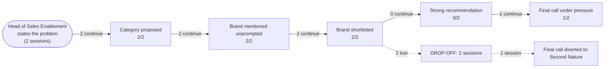

# AI Brand Perception Audit: Hyperbound

- **Category:** AI sales roleplay and practice platforms
- **Buyer persona:** Head of Sales Enablement — B2B SaaS company, 150 sellers across SDRs and AEs, hiring 15-20 new reps per quarter.
- **Jobs to be done:** get new reps to full productivity quickly and predictably; certify rep readiness before they get in front of real buyers; scale coaching and practice without eating manager time
- **Priorities:** cut ramp time: it has slipped and the CRO is watching; prove enablement's impact on revenue with hard numbers; roll out fast without a heavy program build
- **Scenarios:** ramp-slipping, first-call-practice
- **Assistants probed:** claude
- **Sessions:** 2 (scenarios x assistants) | **Date:** 2026-07-17
- **Failed sessions (excluded):** ramp-slipping x gemini, first-call-practice x gemini

## The funnel

| Stage | Result |
|---|---|
| Category proposed | 2/2 |
| Brand mentioned unprompted | 2/2 |
| Brand shortlisted | 2/2 |
| Strong recommendation | 0/2 |
| Final call under pressure | 1/2 |

## Buyer journey map

## Session summaries

### ramp-slipping x claude

- Category proposed: True (as: applied practice with feedback, structured roleplay practice, AI-simulated buyer conversations, AI roleplay tool, scored practice reps, AI roleplay/practice tools)
- Shortlist: Second Nature, Hyperbound, Mindtickle, Quantified.ai, Bigtincan (Brainshark)
- Verdict on Hyperbound: **qualified**
- Qualifiers: recommend only as one of two finalists in a paid pilot, not sole-source; scoring maturity is the big unknown; startup risk / longevity concerns; reference depth must be verified; specific claims should be verified directly, not treated as fact
- Preferred over you: Second Nature (More established with more track record on scoring maturity and mid-market ramp/certification deployments, which offsets Hyperbound's biggest risks (scoring maturity, longevity); more defensible internal choice for a CRO-visible metric)
- Sources cited: general market knowledge up to training cutoff, reasoning by analogy from category patterns, general knowledge of AI sales-roleplay vendor positioning (nothing from the brand's own content)
- Proof gaps: Verified evidence that Hyperbound's practice scores correlate with real call/quota-ramp performance; References at similar-size B2B SaaS companies using it for certification gating; Current funding stage, runway, and company stability; Confirmation it specifically supports certification-gating use case; Current pricing and pilot terms
- Under pressure: **caveats stand** | final call: **Second Nature**
- Dealbreakers: No verified evidence that the vendor's practice score predicts real call performance for a company like theirs
- Own-information confidence: Assistant repeatedly admitted its information is inferential, not verified — moderate-to-low confidence, based on category patterns and general market knowledge up to training cutoff, with no real-time access to website, pricing, customer list, G2 reviews, or funding data. Told buyer to verify via G2/Capterra reviews filtered by company size, ask for 3 similar-size references using it for certification gating, ask about funding stage/runway, get a live demo using their actual scenario, check Crunchbase/LinkedIn/TechCrunch, and cross-check against Second Nature.
- CEO pitch for the final call: We're piloting two AI roleplay vendors against our actual ramp-time problem instead of committing to one on a demo, because the entire value of this investment depends on whether their practice scores predict real call performance — something no vendor's sales pitch can prove, only our own data can. A three-week parallel test with a slice of our next hiring cohort costs us almost nothing and de-risks a decision that will directly affect how fast we can tell you ramp time has improved. If we skip this step and pick wrong, we won't find out until we've already told you it's fixed.
- Would change its mind if: A reference customer of similar size and motion who used the vendor specifically for pre-live-call certification gating and can show that reps' practice scores actually correlated with real quota-ramp outcomes

### first-call-practice x claude

- Category proposed: True (as: AI-driven roleplay tools, async AI-driven practice, AI roleplay tool, simulated buyer conversations, AI/simulated practice)
- Shortlist: Hyperbound, Second Nature, MindTickle (Role-Play/Practice module), Quantified.ai, Highspot / Bigtincan
- Verdict on Hyperbound: **qualified**
- Qualifiers: newer, smaller company with less certainty about long-term stability and support depth at 150-seller scale; customization depth unverified — how much lift to make AI buyers sound like your actual prospects; integration maturity with your specific stack unverified; reference-checking at your scale matters more than usual; legitimate shortlist candidate, not a clear obvious pick and not a red flag
- Preferred over you: none
- Sources cited: general knowledge from training data, public positioning / website messaging, product category / market chatter, pattern-matching on how AI roleplay vendors typically position themselves
- Proof gaps: Verified customer references at 150-seller scale and 15-20 hires/quarter hiring velocity; Evidence of customization depth for a specific objection library; Integration maturity with CRM/LMS/call recording; Support quality and company stability signals (funding, headcount); G2/Gartner/third-party review data; Verified side-by-side product comparison vs Second Nature
- Under pressure: **caveats stand** | final call: **Hyperbound**
- Dealbreakers: If simulated AI buyer is not realistic to senior AEs on actual hard objections — the whole certification would be built on a false signal
- Own-information confidence: Assessment is based on training-data general knowledge and public positioning, not live browsing, current pricing, recent press, real-time G2/Gartner data, or verified customer references; knowledge has a training cutoff in a fast-moving category so features/pricing/positioning may be outdated. Told buyer to verify via G2/Capterra reviews filtered by company size, direct reference calls at their scale, current pricing/contract terms, a hands-on demo with own scenarios, funding/stability signals, and an integration check; and explicitly not to cite the comparisons as a basis for the decision itself.
- CEO pitch for the final call: We're piloting Hyperbound because our new reps' first live call is currently their first real practice, and that's directly slowing ramp and burning pipeline the CRO has flagged. Hyperbound lets reps rehearse discovery and objection handling as many times as needed, on their own time, with instant scoring — solving the problem without adding to already-overloaded managers' workload. We're running it as a two-to-three week pilot on our next hiring cohort with clear pass/fail criteria, so we commit real budget only once we have our own data, not vendor claims.
- Would change its mind if: A pilot transcript where Hyperbound's AI buyer, given one of your actual hard objections, responds in a way that senior AEs say no real prospect would ever say — i.e., the simulated buyer isn't realistic to people who actually run these calls.

## How AI models see the brand

Across both sessions, Claude places Hyperbound on the shortlist without being prompted, and in both cases the underlying belief set is consistent: Hyperbound is seen as a purpose-built AI buyer-simulation tool, narrow and deep rather than a broad platform, fast to spin up, likely cheaper and more pilot-friendly than the established alternatives, and aimed squarely at the "score and gate" use case for ramping reps. This is a favorable read of what the product does. The recurring liability is equally consistent: Hyperbound is a newer, smaller, venture-backed company whose scoring maturity, stability, and enterprise readiness at 150-seller scale are unverified.

Where the brand wins: relevance to the persona's core job. In the first-call-practice scenario the assistant reads Hyperbound as designed specifically for pre-live-call practice with automatic scoring and a self-serve feedback loop, and this alignment is strong enough to make it the final pick. The assistant explicitly credits "narrow and deep" positioning as implying faster time-to-value and less implementation overhead, which maps directly to the persona's "roll out fast without a heavy program build" priority.

Where the brand loses: proof of outcome and proof of durability. In the ramp-slipping scenario, the same product strengths are present, but the decision hinges on a higher-stakes question, whether practice scores predict real call performance, and here Hyperbound's youth counts against it. The assistant switches to Second Nature, reasoning that an established vendor with more track record on scoring maturity and mid-market certification deployments is "a more defensible internal choice for a CRO-visible metric." The differentiator between the two scenarios is not the product, it is the stakes: when the buyer's job is tied to a number the CRO is watching, the assistant retreats to the safer, more proven name.

**The verdict is scenario-dependent: Hyperbound wins when the job is "get reps practicing," and loses to Second Nature when the job is "prove the score is real to a watching CRO."**

Under pressure, the pattern is instructive. In neither session did the qualifiers simply dissolve into a clean endorsement; both ended with caveats standing. The soft material, points that read as manageable evaluation tasks, stayed as conditions rather than blockers: customization depth, integration maturity, support quality, and reference-checking were all framed as things to verify in a pilot, not reasons to walk away. What hardened into a genuine dealbreaker was narrow and specific in each case. In first-call-practice, it was realism: if senior AEs judge the simulated buyer as unrealistic on hard objections, the entire certification rests on a false signal. In ramp-slipping, it was predictive validity: the absence of verified evidence that practice scores predict real call performance was strong enough to move the final call to a competitor. The longevity and scoring-maturity concerns did not just add hedging in that scenario, they produced the switch.

## What information drives AI opinion

The verdicts rest almost entirely on inference, not on verified fact. In the ramp-slipping session the assistant cited only general market knowledge, reasoning by analogy from category patterns, and general knowledge of vendor positioning, with no first-party sources. It repeatedly flagged its own confidence as moderate-to-low and disclosed no real-time access to the website, pricing, customer list, G2 reviews, or funding data.

The first-call-practice session is the more important signal for the brand. Here the assistant did draw on first-party sources: public positioning and website messaging shaped its beliefs that Hyperbound is "purpose-built for AI buyer personas," has "a fairly deep scenario/persona library," and that its "marketing and product structure lean toward score and gate." This is the one session where Hyperbound became the final pick, and it is also the one session where the brand's own content was doing the work. That correlation matters: when Claude could see and repeat Hyperbound's positioning, it chose Hyperbound. When it was working only from category memory, it chose the safer incumbent.

The critical gap is that no third-party evidence entered either decision. No G2 or Gartner data, no verified references, no funding or headcount signals, no outcome studies. The positioning is landing, but there is nothing behind it to convert a "qualified" recommendation into a confident one or to survive the CRO-stakes pressure test.

## What proof AI models need to see to choose the brand

| Rank | Proof gap | Sessions flagging it | Impact on recommendation |
|------|-----------|---------------------|--------------------------|
| 1 | Verified evidence that practice scores correlate with real call and quota-ramp performance | ramp-slipping | This was the named flip condition and the stated dealbreaker; its absence is the main reason the assistant recommended Second Nature instead of Hyperbound. |
| 2 | Proof the AI buyer is realistic to senior AEs on hard objections | first-call-practice | This was the named flip condition and the dealbreaker for the scenario Hyperbound won; without it the pick stays qualified and one bad pilot transcript would reverse it. |
| 3 | References at similar 150-seller scale using the tool specifically for certification gating | both | Kept both recommendations at "qualified" rather than strong, and in ramp-slipping compounded the youth concern that drove the switch to a competitor. |
| 4 | Company stability signals: funding stage, runway, headcount | both | Fed the "startup risk / longevity" qualifier that made the assistant favor the more established vendor as the "defensible" choice on a CRO-visible metric. |
| 5 | Customization depth for a specific objection library | first-call-practice | Added hedging about implementation lift but did not change the pick. |
| 6 | Integration maturity with CRM, LMS, and call recording | first-call-practice | Added hedging but did not change the pick. |
| 7 | Third-party review data (G2, Capterra, Gartner) filtered by company size | both | Absence forced the assistant to caveat all confidence as inferential and to route the buyer elsewhere to verify. |

The top two rows are where the decision actually turns. Both are outcome and realism claims, not feature claims, and both were named by the assistant itself as the single thing that would change its final call.

## Recommended positioning and content changes

The through-line: Hyperbound's positioning is already reaching the assistant and already wins the practice-readiness job. What it loses on is proof of outcome, proof of realism, and proof of durability, precisely the questions that surface when the buyer's own credibility with the CRO is on the line. The priorities below are ordered by their effect on the verdicts above.

1. Publish a score-to-performance validation study. This is the highest-leverage action because it targets the number-one flip condition and the dealbreaker that produced the competitor switch. Publish a study, ideally with a named or anonymized mid-market SaaS customer, showing that reps' Hyperbound practice scores correlate with real quota-ramp or live-call outcomes. State the sample size, the ramp metric, and the correlation plainly. This is the one asset that directly attacks the "no vendor's pitch can prove the score is real" reasoning the assistant used to justify Second Nature.

2. Publish evidence of AI-buyer realism validated by senior sellers. This targets the second flip condition, the realism dealbreaker in the scenario Hyperbound already wins. Create content showing experienced AEs stress-testing the AI buyer on hard objections and confirming the responses are true to real calls. Sample transcripts on hard objections, with practitioner commentary, would pre-empt the exact failure mode the assistant named: an AI buyer that says something no real prospect would say.

3. Build and place certification-gating case studies at the persona's scale. Publish references from B2B SaaS companies of roughly 150 sellers hiring 15-20 reps per quarter, using Hyperbound specifically for pre-live-call certification gating, with named ramp-time results. This addresses the number-three gap flagged in both sessions and converts "qualified" toward "strong." Explicitly frame these around the certification-gating use case, since the assistant twice listed "confirmation it supports certification gating" as an open question despite reading the product as built for exactly that.

4. Make stability and scale signals easy to find. The "startup risk / longevity" qualifier fed directly into the competitor switch on the CRO-visible metric. Publish funding stage, customer count, and enterprise-scale deployment proof in a place the assistant can read as first-party. This does not require overclaiming; it requires removing the information vacuum that currently defaults to a longevity concern.

5. Reinforce the "narrow and deep, fast to deploy" language, which is already working. The assistant independently credited this positioning for faster time-to-value and lighter implementation, mapping to the persona's "roll out fast" priority. Keep it prominent and pair it with concrete time-to-live-pilot figures.

6. Get third-party review coverage at company-size granularity. Both sessions routed the buyer to G2 and Capterra filtered by company size to verify claims the assistant could not confirm itself. Actively grow reviews from mid-market SaaS customers so that when the assistant, or the buyer, checks those sources, the evidence is present rather than absent.

On placement: the first-call-practice session shows that first-party website and positioning content is being read and is shaping beliefs, while third-party sources are being consulted for verification. The implication is to publish the outcome, realism, and stability proof on owned properties where the model already looks, and to seed the reference and review evidence on the third-party sites the model sends buyers to when it needs to check.
