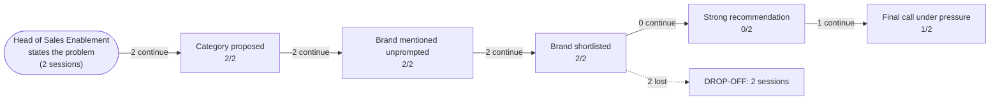

# AI Brand Perception Audit: Hyperbound

- **Category:** AI sales roleplay and practice platforms
- **Buyer persona:** Head of Sales Enablement — B2B SaaS company, 150 sellers across SDRs and AEs, hiring 15-20 new reps per quarter.
- **Jobs to be done:** get new reps to full productivity quickly and predictably; certify rep readiness before they get in front of real buyers; scale coaching and practice without eating manager time
- **Priorities:** cut ramp time: it has slipped and the CRO is watching; prove enablement's impact on revenue with hard numbers; roll out fast without a heavy program build
- **Scenarios:** ramp-slipping, first-call-practice
- **Assistants probed:** claude
- **Sessions:** 2 (scenarios x assistants) | **Date:** 2026-07-17
- **Failed sessions (excluded):** ramp-slipping x gemini, first-call-practice x gemini

## The funnel

| Stage | Result |
|---|---|
| Category proposed | 2/2 |
| Brand mentioned unprompted | 2/2 |
| Brand shortlisted | 2/2 |
| Strong recommendation | 0/2 |
| Final call under pressure | 1/2 |

## Buyer journey map

## Session summaries

### ramp-slipping x claude

- Pathway: vendor comparison (assistant named Mindtickle unprompted in stage 1)
- Category proposed: True (as: scenario-based practice reps, AI roleplay/practice module, dedicated AI conversation-practice tools, conversation-practice tool, AI roleplay for sales reps, dedicated practice tool)
- Shortlist: Second Nature, Bryq, Hyperbound, Quantified, Yoodli
- Verdict on Hyperbound: **qualified**
- Qualifiers: no reliable real-time detail on current feature set, pricing, or customer results; verify integration depth with Gong and Salesforce; confirm rubric customization vs. generic default scoring; check scenario authoring effort for a lean team; demand evidence of behavior transfer, not just engagement; pressure-test pricing model at 150+ seats and high hiring velocity; should be evaluated against at least one real alternative, not in a vacuum
- Preferred over you: none
- Sources cited: general awareness from training data, vendor content, industry commentary, case studies through training cutoff, category/structural knowledge (nothing from the brand's own content)
- Proof gaps: Confirmed integration depth with Gong and Salesforce (scores auto-syncing to Salesforce); Customizable rubric dimensions mapping to specific behaviors like frame-holding and diagnostic questioning; Low scenario authoring lift for enablement team without solutions-engineer help; Case studies / reference customers showing Gong-verified call behavior improvement at 100+ reps; Clear pricing model that scales reasonably at 150+ seats and 15-20 hires/quarter
- Under pressure: **caveats stand** | final call: **Hyperbound**
- Dealbreakers: If reps clear a high rubric score in week one or two with minimal repetition and little variance between strong and weak reps — indicating the AI buyer isn't holding pressure, the rubric is too loose, or reps are gaming it — meaning it isn't solving the freeze problem
- Own-information confidence: The assistant explicitly stated it did not have reliable real-time detail on Hyperbound's current feature set, pricing tier, or recent customer results, that its knowledge came from training data with a cutoff, and that its view should be treated as directional judgment to guide demo/RFP questions — not a substitute for reference calls and a live trial. It told the buyer to verify integration depth, rubric customization, authoring effort, behavior-transfer evidence, and pricing directly, and to source any CFO/CEO-facing claims via analyst reports, peer communities, and vendor references rather than relying on the assistant.
- CEO pitch for the final call: Our new-hire ramp has slipped from four months to six, and the root cause is that reps pass certification but freeze in real conversations because they've never rehearsed under actual pressure. Hyperbound gives reps unlimited live-fire practice against realistic AI buyers before they're ever in front of a real prospect, closing the exact gap between 'certified' and 'call-ready.' We're piloting it now against our existing tools and expect to show measurable improvement in rep call behavior within weeks, well ahead of the quota impact hitting the board.
- Would change its mind if: If the pilot showed reps hitting a high rubric score on Hyperbound's scenarios in week one or two with minimal repetition and little variance between strong and weak reps — signaling the AI buyer isn't holding pressure, the rubric is too loose, or reps are gaming it fast.

### first-call-practice x claude

- Pathway: vendor comparison (assistant named Mindtickle unprompted in stage 1)
- Category proposed: True (as: AI-powered practice reps, AI role-play/simulation, AI simulation, conversation-practice tools, purpose-built conversation AI tools, AI buyer/prospect simulation)
- Shortlist: Second Nature, Hyperbound, Quantified
- Verdict on Hyperbound: **qualified**
- Qualifiers: worth putting on the list because reps in the space name it unprompted, but not clearly 'worth testing first' over two others; no reliable first-hand knowledge of product depth or results; positioning claims are marketing-shaped, treat as hypothesis not fact; should be tested in a 3-way bake-off, not committed to on the assistant's word; only pursue if Mindtickle pilot data shows the gate is failing
- Preferred over you: none
- Sources cited: training data likely including Hyperbound's own website copy, press coverage echoing their positioning, general category framing, secondhand/name-recognition impressions
- Proof gaps: Verified feature-for-feature comparison vs Second Nature/Quantified; Evidence the AI catches unready reps vs letting weak answers slide; Reference customers at the buyer's scale (150 reps, 15-20/quarter hiring); Actual onboarding time in enablement hours; Out-of-the-box Salesforce/Mindtickle integration capability without services engagement; G2/Capterra reviews filtered by similar company size
- Under pressure: **caveats stand** | final call: **deferred**
- Dealbreakers: none
- Own-information confidence: The assistant admitted it had no reliable, current, first-hand knowledge of Hyperbound's product depth, results, or competitive standing; that its 'directionally useful context' was pattern-matching from training data likely including the vendor's own website copy and press echoing their positioning, not verified fact; and that the space changes quarter to quarter. It told the buyer to verify via G2/Capterra reviews filtered by company size, LinkedIn users/posts, peer network questions, reference calls with same-size customers, founders' background via LinkedIn, and a live bring-your-own-Gong-clip demo test rather than canned demoware.
- CEO pitch for the final call: We're closing the gap where new reps' first live call is effectively their first practice — every rep will rehearse real Gong-sourced objections and get certified before touching pipeline. We're building this in Mindtickle, a tool we already own and reps already use, so it ships this quarter with no new procurement or integration risk. If the data shows it's not catching underprepared reps, we'll evaluate a specialized tool next quarter with real evidence in hand — not before.
- Would change its mind if: A rep who passes Mindtickle's certification and then visibly struggles on the corresponding skill in a real early call (Gong shows them freezing/fumbling on the exact objection type they were certified on), as a repeat pattern not a fluke.

## How AI models see the brand

Both sessions ran on Claude (sonnet-5), and both entered through the `vendor_comparison` pathway, meaning the assistant mapped the persona's problem to named vendors without being prompted to. That is a positive finding for the category: when a Head of Sales Enablement describes slipped ramp and reps freezing on live calls, Claude reaches for a dedicated AI conversation-practice tool on its own. Notably, the only vendor named unprompted in stage 1 was Mindtickle, the tool already in the buyer's stack, not Hyperbound. Hyperbound surfaces reliably in the shortlist but as a candidate the buyer must be steered toward, not as the assistant's opening reflex.

The consistent belief set across both sessions is coherent and favorable. Claude sees Hyperbound as purpose-built for practice rather than a certification feature bolted onto a broader platform, as voice-based rather than chat-only, as built by sales-background founders, and as offering realistic, configurable AI buyer personas. In the ramp-slipping session it went further, describing Hyperbound as "the entire company is built around the practice rep," which reads as a genuine differentiation from Mindtickle and Quantified. Critically, in the first-call-practice session the assistant treated the fact that "reps in the space name it unprompted" as real signal, not marketing. That is the strongest asset Hyperbound has here: category-native reputation the model already carries.

Where the brand wins: category fit for the specific pain (reps who pass certification but freeze under live pressure), and the perception that scenario authoring is fast because practice is the core product. Where it loses: it never clearly beats Second Nature or Quantified head to head. In both sessions it was placed in a shortlist alongside those two, and in the first-call session the assistant explicitly said Hyperbound was "not clearly worth testing first over two others." The verdict in both sessions was **qualified, never a clean recommendation.**

The two sessions diverged sharply at the final call, and the reason is instructive. In ramp-slipping, the final call was Hyperbound (`target_brand`). In first-call-practice, the final call was `neither_or_defer`: the assistant told the buyer to build the first-call practice inside Mindtickle, the tool already owned, and only pursue a specialist "if Mindtickle pilot data shows the gate is failing." This is the single most important competitive finding in the audit. The most dangerous competitor to Hyperbound in these sessions was not Second Nature or Quantified. It was the incumbent already in the stack. When the problem was framed as ramp duration, Hyperbound won; when framed as a certification-gate gap, the assistant defaulted to extending Mindtickle rather than buying a new tool, on the logic that it "ships this quarter with no new procurement or integration risk."

Under pressure, the qualifiers behaved in three ways. Soft objections that dissolved: none dissolved cleanly; the assistant held its caveats in both sessions (`pressure_outcome: caveats_stand` twice). What stood as conditions: integration depth with Gong and Salesforce, rubric customization versus generic default scoring, scenario authoring lift for a lean team, pricing at 150-plus seats, and evidence of behavior transfer rather than engagement. These persisted as demo and RFP questions rather than resolving. What hardened into a dealbreaker: in ramp-slipping, the assistant named one, if reps clear a high rubric score in week one or two with little variance between strong and weak reps, that would signal the AI buyer is not holding pressure and Hyperbound is not solving the freeze problem. That is also its stated flip condition. The first-call session's flip condition ran the other way: a rep who passes Mindtickle certification and then visibly fumbles the exact objection type on a live Gong call, as a repeat pattern, is what would move the assistant off "defer" and toward a specialist. In that session, Hyperbound does not win on its own merits; it wins only when the incumbent is proven to fail.

## What information drives AI opinion

The verdicts rest almost entirely on Hyperbound's own positioning, and the assistant knows it. In both sessions Claude flagged that its knowledge came from training data through a cutoff, that it had "no reliable real-time detail on current feature set, pricing, or customer results," and in first-call-practice named the sources explicitly: "training data likely including Hyperbound's own website copy" and "press coverage echoing their positioning." It labeled the positioning claims "marketing-shaped, treat as hypothesis not fact."

This is the central vulnerability. Every favorable belief (voice-based, harder-to-game personas, fast authoring, sales-founder credibility) traces to vendor-controlled content, and the assistant discounts each accordingly. The one belief it treated as independent signal was unprompted naming by reps in the space, which is community reputation, not owned content. There is no third-party evidence in the model's view: no analyst positioning, no size-matched case studies, no G2 reviews filtered by company size that it could cite. `brand_sources_first_party` was true in one session and false in the other, but in both, the assistant's confidence was low and it pushed the buyer to verify externally: G2/Capterra filtered by size, LinkedIn users, peer networks, reference calls with same-size customers, and a bring-your-own-Gong-clip live demo.

The practical consequence: the brand's own content got Hyperbound onto the shortlist and no further. It could not close the verdict because the assistant explicitly refused to treat vendor-shaped claims as proof. The verdicts are held open by the absence of third-party and first-party-customer evidence, exactly the "proof I can put in front of a CFO" the persona named as a decision criterion.

## What proof AI models need to see to choose the brand

| Rank | Proof gap | Sessions flagging it | Impact on recommendation |
|------|-----------|---------------------|--------------------------|
| 1 | Evidence the AI buyer holds pressure: measurable score variance between strong and weak reps, reps not clearing high scores in week one | ramp-slipping (named as dealbreaker and flip condition) | This is the evidence the assistant said would flip its final call away from Hyperbound if unmet; it is the make-or-break proof for the winning scenario. |
| 2 | Size-matched case studies showing Gong-verified live-call behavior improvement and faster ramp at 100-plus reps hiring 15-20/quarter | both sessions | Kept the verdict at qualified rather than strong and left the door open for the incumbent; without it the assistant would not commit on its own word. |
| 3 | Proof practice transfers to live-call performance, not just engagement | both sessions | Directly addresses the persona's core buying criterion; its absence is why the first-call session defaulted to extending Mindtickle instead of buying Hyperbound. |
| 4 | Confirmed integration depth with Gong and Salesforce, scores auto-syncing to Salesforce, working alongside Mindtickle | both sessions | Softened the verdict and, in first-call-practice, was the assistant's stated reason to prefer the already-integrated incumbent (no new integration risk). |
| 5 | Low scenario-authoring lift for a lean enablement team without solutions-engineer help | both sessions | Added hedging on the "light enough to run" criterion; unresolved, it kept Hyperbound a hypothesis rather than the clear pick. |
| 6 | Customizable rubric dimensions mapping to specific behaviors (frame-holding, diagnostic questioning) versus generic default scoring | ramp-slipping | Feeds directly into gap 1; without it the assistant cannot trust that a passing score means call-ready. |
| 7 | Clear pricing model that scales at 150-plus seats and high hiring velocity | both sessions | Added a CFO-facing risk the assistant flagged repeatedly; did not change the pick but reinforced the qualified stance. |
| 8 | Third-party validation: G2/Capterra filtered by company size, analyst mention, peer-network references | first-call-practice | Its absence is why the assistant discounted all positioning as marketing and refused to close on vendor claims alone. |

The two flip conditions deserve special weight because they define the decision boundary. Proof gap 1 is the evidence that keeps the winnable scenario won: if a pilot shows reps gaming the AI or clearing scores too easily, Claude will drop Hyperbound. Proof gap 3 is what unlocks the scenario Hyperbound currently loses: the first-call session only moves off Mindtickle when Gong data proves the incumbent's certification does not transfer to live calls. Both point at the same underlying asset, verifiable evidence that a Hyperbound score predicts real-call performance.

## Recommended positioning and content changes

**1. Publish the pressure-and-transfer evidence as the flagship proof asset.** The single highest-leverage move is a study, ideally co-signed with a named same-size customer, that shows two things the assistant explicitly demanded: score variance between strong and weak reps (the AI buyer holds pressure and is not gameable), and a correlation between Hyperbound practice scores and subsequent Gong-measured live-call behavior. This addresses proof gaps 1 and 3, which are the two flip conditions. Frame it as "practice-to-live-call transfer," using the exact language the persona uses. Place it where a model retrieves it: a dedicated, crawlable results page, plus a press or analyst mention so it does not read as pure owned content.

**2. Build the size-matched, CFO-ready reference set.** The persona and the assistant both asked for references at 150 reps hiring 15-20 per quarter, not blog posts. Produce two or three named case studies at that scale with hard ramp-time deltas (for example, "ramp cut from six months to four"). This directly attacks the qualified verdict and the assistant's repeated instruction to "verify via reference calls with same-size customers." Publish them as structured, quotable pages, not gated PDFs, so they enter the model's retrievable content.

**3. Reposition explicitly as complementary to Mindtickle, not a replacement.** The most consequential loss in this audit was the assistant recommending the buyer extend Mindtickle rather than buy Hyperbound, on integration and procurement-risk grounds. Counter this head on with a "Hyperbound plus Mindtickle" positioning page and a documented integration: scores flowing into Salesforce and coexisting with a Mindtickle rollout. State plainly that Hyperbound is the live-fire practice layer that Mindtickle's certification gate lacks. This converts the incumbent from a substitute into a partner and neutralizes the "no new integration risk" argument that beat Hyperbound in the first-call session.

**4. Publish a "lean-team rollout" proof point.** The assistant twice flagged scenario-authoring lift and onboarding hours for a lean team. Publish a concrete authoring benchmark (for example, "a new scenario in under X minutes, no solutions engineer required") and a rollout timeline showing measurable results within one quarter, matching the buyer's stated deadline. This addresses proof gap 5 and the "roll out fast without a heavy program build" priority.

**5. Publish a transparent, seat-scaled pricing frame.** The assistant repeatedly listed pricing at 150-plus seats as an open CFO risk. Even a pricing methodology page that shows the model scales sensibly at high hiring velocity would remove a standing qualifier.

**6. Seed and support third-party signal.** The one belief the assistant treated as independent was reps naming Hyperbound unprompted. Reinforce that channel: encourage size-matched G2 reviews that state company size, and cultivate LinkedIn and peer-community references from enablement leaders at 150-rep SaaS companies. This is the only lever that moves the assistant off its "treat positioning as marketing hypothesis" stance, because it is the only evidence class it currently trusts.

Priority order: items 1 and 3 first, because they respectively defend the scenario Hyperbound wins and reclaim the scenario it currently loses to the incumbent. Items 2 and 6 next, because they supply the CFO-grade, third-party evidence that is keeping every verdict at qualified. Items 4 and 5 close the remaining standing conditions.
