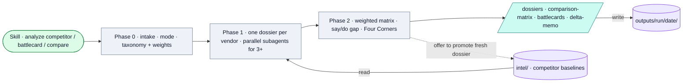

# Competitive Intel Researcher

*Decision-driven competitive intelligence on 1–5 vendors — evidence-graded dossiers, a weighted comparison matrix, say/do gap analysis, Four Corners response prediction, and Know/Say/Show battlecards.*

## Flow

## How it runs

A pure-methodology Claude skill — no scripts. Collection is web research the agent (and parallel general-purpose subagents for 3+ vendors) performs against docs, changelogs, review sites, and pricing pages. Four modes: deal support, landscape, monitoring refresh, positioning/prep. Also served over MCP (it works fully for MCP recipients because there's no code to transfer).

## Services & stores

| Thing | Type | Detail |
|---|---|---|
| Web research | (agent work) | No coded API dependency; method sources are intellectual (SCIP, Porter, Forrester, Clozd, Klue) |
| `intel/<competitor-slug>/` | Store | Prior baselines read at Phase 1 |
| `outputs/<run-slug>/<date>/` | Store | `dossier-*.md`, `comparison-matrix.md`, `battlecard-*.md`, `delta-memo.md` |

## Connects to

- Shares the `intel/` baseline dir with the (planned) Transcript Router; offers to promote fresh dossiers back as new baselines.
- Distributed by the [MCP Server](../../mcp-server/SYSTEM.md) (one of the three included skills).

## Gotchas

- Pure methodology — no external API keys, no Gateway. A full design doc lives outside the repo (in Claude Outputs).

## Sources

`SKILL.md`, `README.md`, `references/dossier-template.md`, `references/battlecard-template.md`
