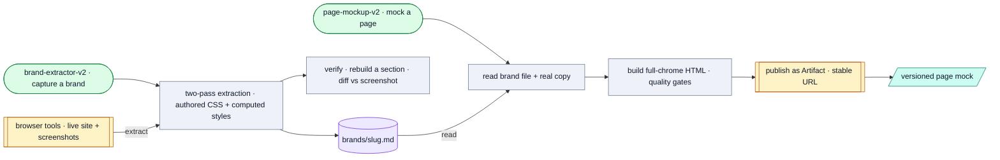

# Landing Page Builder

*A two-skill pipeline: capture a brand's design system + voice once (brand-extractor-v2), then generate unlimited true-to-life on-brand HTML page mocks with real copy (page-mockup-v2).*

## Flow

## How it runs

Two local Claude skills (methodology only, no Python). The extractor captures a brand once via browser tools into a single brand file; the mockup skill consumes that file + copy to build a self-contained HTML page, published as a Claude Artifact (iterations redeploy the same URL). No paid APIs, no Gateway. Note: the folders are named `brand-extractor`/`page-mockup` but install as the **`-v2`** skill names.

## Services & stores

| Thing | Type | Detail |
|---|---|---|
| Browser tools | Service | Live-site extraction + screenshots |
| Artifact publishing | Service | Stable shareable URL, versioned in place |
| `page-mockup/brands/<slug>.md` | Store | Per-company design system (`commure.md`, `dw-digital.md` ship) |

## Connects to

- Internal pipeline: brand-extractor-v2 → page-mockup-v2 (extractor writes the brand file the mockup consumes).
- Distinct from `../../brand-pack/` — that holds Dhruv's own positioning for the planned Copywriter; these are per-target-company design systems (a different layer).
- Optionally offers the `copy-optimizer` / `ai-detector` skills before shipping.

## Gotchas

- Prefer these **v2** repo-hosted variants over any installed v1 `brand-extractor`/`page-mockup` skills when both exist.
- Not included in the MCP server.

## Sources

`brand-extractor/SKILL.md`, `page-mockup/SKILL.md`, `page-mockup/brands/*`, `references/`
