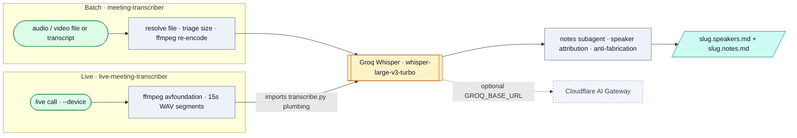

# Meeting Transcription (batch + live)

*Two front doors into one transcription pipeline — an existing recording or a live call — both feeding a shared Groq Whisper path and a shared speaker-attributed notes step. Covers both `meeting-transcriber` and `live-meeting-transcriber`.*

## Flow

## How it runs

Two local Claude skills that share one Groq plumbing module. **Batch** (`meeting-transcriber`) resolves a file, triages size (~15 MB practical ceiling; extract audio / re-encode to 16kHz mono via ffmpeg), transcribes via Groq, then dispatches the notes subagent — portable, runs anywhere. **Live** (`live-meeting-transcriber`) is Mac-only (mic-bound): `live_transcribe.py` captures 15s WAV segments via ffmpeg and **imports the batch skill's `transcribe.py` plumbing** (single source of truth), then hands its finalized transcript to the same notes step. Both honor `GROQ_BASE_URL` to route through the Cloudflare AI Gateway; direct-to-Groq by default.

## Services & stores

| Thing | Type | Detail |
|---|---|---|
| Groq Whisper API | Service | `whisper-large-v3-turbo`, free, headless |
| ffmpeg / ffprobe | Service | Audio extraction (batch) + avfoundation capture (live) |
| `GROQ_API_KEY` | Store | env or `~/.marketing-agents.env` |
| deliverables | Store | `~/Desktop/Claude Outputs/` (`.speakers.md`, `.notes.md`) |

## Connects to

- The two folders **must stay siblings** — live imports `../meeting-transcriber/scripts/transcribe.py`. See the [live pointer](../live-meeting-transcriber/SYSTEM.md).
- Reused cross-repo by the [PMM Interview Evaluator](https://github.com/d-walia/personal-agents/blob/main/agents/pmm-interview-evaluator/SYSTEM.md) for its audio/delivery path.
- Both included in the [MCP Server](../../mcp-server/SYSTEM.md).
- Optional [Cloudflare AI Gateway](https://github.com/d-walia/ai-architecture/blob/main/cloudflare-ai-gateway/SYSTEM.md) routing via `GROQ_BASE_URL`.

## Gotchas

- `transcribe.py` hard-caps at `MAX_BYTES = 25 MB` and errors above that, while SKILL.md guidance says treat ~15 MB as the ceiling and re-encode first — the script does not enforce the 15 MB guidance.
- Live sessions write a gitignored `live-<timestamp>/` dir; the raw transcript is a hand-off, never a deliverable.

## Sources

`meeting-transcriber/SKILL.md`, `meeting-transcriber/scripts/transcribe.py`, `live-meeting-transcriber/SKILL.md`, `live-meeting-transcriber/scripts/live_transcribe.py`, `.claude/agents/meeting-transcriber.md`
