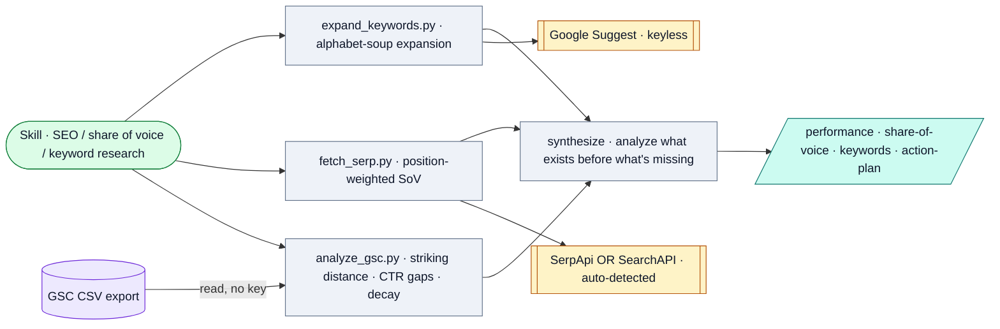

# SEO Performance Monitor

*Measure SEO from a Search Console CSV, track position-weighted share of voice vs competitors, and discover keyword opportunity via Google Suggest — synthesized into an action plan.*

## Flow

## How it runs

A local Claude skill with three stdlib Python CLIs, run from the repo root (reads `config/site.json` for the default domain). Three sources: performance (`analyze_gsc.py`, no key), share of voice (`fetch_serp.py`, priced first with `--dry-run`), opportunity (`expand_keywords.py`, keyless). Google Search Console is read via a **manual CSV export, not the API** — deliberately, to avoid OAuth. No Groq, no Gateway.

## Services & stores

| Thing | Type | Detail |
|---|---|---|
| Google Suggest | Service | `suggestqueries.google.com`, no key |
| SerpApi OR SearchAPI.io | Service | Auto-detected from whichever key is present |
| `config/site.json` | Store | Default domain + competitor list |
| `outputs/seo/<domain>/<date>/` | Store | Four Markdown files; `action-plan.md` is the deliverable |

## Connects to

- Layer-1 "search fundamentals" alongside [Site Auditor](../site-auditor/SYSTEM.md).
- **Excluded from the [MCP Server](../../mcp-server/SYSTEM.md)** — stays private for client work.

## Gotchas

- Provider auto-detection means the SERP source depends on which key you set (SerpApi 250/mo vs SearchAPI 100 one-time).

## Sources

`SKILL.md`, `config/site.json`, `scripts/analyze_gsc.py`, `scripts/fetch_serp.py`, `scripts/expand_keywords.py`
