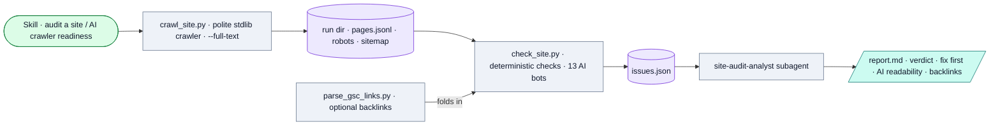

# Site Auditor

*Crawl a site into a structured page corpus and audit it for technical SEO health plus AI-crawler readability (bot access, server-rendered content, structured data, llms.txt).*

## Flow

## How it runs

A local Claude skill with three stdlib CLIs plus one analyst subagent, run from the repo root. Three deliberately separated layers: the crawler collects (`crawl_site.py`, polite, `--full-text` optional), the checks compute (`check_site.py`, deterministic, free to re-run, no network), the analyst interprets (`site-audit-analyst` subagent). **No keys, no gateway** — the crawler talks only to the audited site; analysis runs inside the Claude subscription.

## Services & stores

| Thing | Type | Detail |
|---|---|---|
| Audited site | (fetch) | HTML, robots.txt, sitemap via stdlib urllib (identifying UA) |
| `runs/<domain>/<timestamp>/` | Store | `pages.jsonl`, `crawl-summary.json`, `issues.json`, `report.md` |
| GSC Links export | Store | Optional input for the backlink section |

## Connects to

- Layer-1 alongside [SEO Performance Monitor](../seo-performance-monitor/SYSTEM.md); its `--full-text` corpus is the collection half feeding the planned Competitor Content Analyzer (Layer 4).
- Verdict logic (13 AI bots, robots rules) is **hand-synced** with the [Avowed crawlability checker](https://github.com/d-walia/ai-brand-auditor/blob/main/crawlability-checker/SYSTEM.md).
- **Not** in the MCP server.

## Gotchas

- `runs/` is gitignored but two example runs (`dw-digital-consulting.com`, `hyperbound.ai`) are committed as demo artifacts.
- Paid upgrade (DataForSEO for competitor backlinks/volumes) is documented but not built.

## Sources

`SKILL.md`, `scripts/crawl_site.py`, `scripts/check_site.py`, `scripts/parse_gsc_links.py`, `.claude/agents/site-audit-analyst.md`
