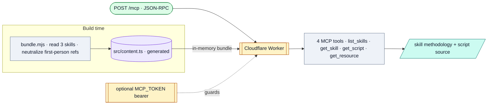

# Marketing Agents MCP Server

*A Cloudflare Worker that serves a subset of the repo's skills over the Model Context Protocol, so they install by pasting a URL into Claude instead of cloning the repo.*

## Flow

## How it runs

The one piece of **deployed** infra in the repo. At build time `scripts/bundle.mjs` reads the three included skills, neutralizes first-person references to generic prose, and writes `src/content.ts`. The runtime Worker answers JSON-RPC over Streamable HTTP (`POST /mcp`), exposing four read-only tools from the in-memory bundle (no runtime file access or fetch). Deploy: `npm run deploy` → `wrangler deploy`. Optional bearer-token auth via `MCP_TOKEN`.

## Services & stores

| Thing | Type | Detail |
|---|---|---|
| Cloudflare Worker | Service | Free tier; no Durable Objects / KV / bindings |
| `MCP_TOKEN` | Service | Optional Worker secret for bearer auth |
| `src/content.ts` | Store | Generated, gitignored — the compiled skill bundle |

## Connects to

- Distributes exactly three skills: [Competitive Intel](../agents/competitive-intel-researcher/SYSTEM.md), [Meeting Transcription](../agents/meeting-transcriber/SYSTEM.md), and its live half.
- **Excludes** SEO Performance Monitor (private client work) and the AI Brand Auditor (paid product, separate private repo).

## Gotchas

- The deployed Worker URL isn't in the repo (referenced as a placeholder) — where it's live can't be confirmed from files.
- The `EXTRA_FILES`/`SUBAGENTS` extension maps are empty "since the auditor left," so no config/subagents ship over MCP even for the three included skills.

## Sources

`src/index.ts`, `scripts/bundle.mjs`, `wrangler.jsonc`, `package.json`, `README.md`
