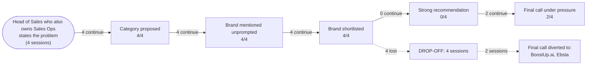

# AI Brand Perception Audit: Gong

- **Category:** revenue intelligence platforms
- **Buyer persona:** Head of Sales who also owns Sales Ops — B2B SaaS company, 120 sales reps, mid-market ACV around 40k USD.
- **Jobs to be done:** hit the quarterly revenue number and defend the forecast to the CEO and board; diagnose why deals stall and fix the pipeline process; build a repeatable coaching program so rep performance doesn't depend on tribal knowledge
- **Priorities:** forecast accuracy above all: the board has lost patience with 20 percent misses; get value fast without a heavy implementation project; prove ROI on any new tooling within two quarters
- **Scenarios:** stalled-deals, board-forecast-pressure
- **Assistants probed:** claude, gemini
- **Sessions:** 4 (scenarios x assistants) | **Date:** 2026-07-16

## The funnel

| Stage | Result |
|---|---|
| Category proposed | 4/4 |
| Brand mentioned unprompted | 4/4 |
| Brand shortlisted | 4/4 |
| Strong recommendation | 0/4 |
| Final call under pressure | 2/4 |

## Buyer journey map

## Session summaries

### stalled-deals x claude

- Category proposed: True (as: conversation intelligence, conversation intelligence tooling, RevOps platform, forecasting platform, revenue intelligence)
- Shortlist: Gong, Clari, Chorus (by ZoomInfo), Jiminny or Attention, Outreach/Salesloft native (existing stack)
- Verdict on Gong: **qualified**
- Qualifiers: yes, conditionally; forecasting is not their core strength despite marketing; adoption is a real tax, not plug-and-play; signal fatigue risk if too many metrics tracked; price at 120 seats will be a serious number; rep trust/privacy friction on call recording; don't buy full seat count on faith - pilot on 2-3 pods first
- Preferred over you: none
- Sources cited: general knowledge from training data with cutoff over a year old, widely-repeated industry framing / analyst commentary, vendor positioning, public case studies, reasoning by pattern rather than real-time evidence (nothing from the brand's own content)
- Proof gaps: current pricing for 120 seats; current feature set / whether forecasting has improved since cutoff; first-hand performance data (customer reviews, satisfaction, churn, implementation success rates); G2/Gartner Peer Insights reviews filtered for similar-size mid-market companies; reference calls with 2-3 current customers of similar size; pilot results on buyer's own call data showing stall-rate/forecast-variance movement
- Under pressure: **caveats stand** | final call: **Gong**
- Dealbreakers: none
- Own-information confidence: Admitted assessment is based on training data with a cutoff over a year old, general/pattern-based reasoning, and industry positioning rather than current verified data; has no current pricing, current feature set, or first-hand performance data. Told buyer to verify via current G2/Gartner reviews filtered for similar-size firms, reference calls with similar-size customers, live current demos, written pricing quotes for actual seat count, and a pilot on their own call data; said not to cite his rankings/claims to CEO/CFO without independent verification.
- CEO pitch for the final call: Our deals aren't stalling because reps are bad at demos — they're stalling because we have no visibility into what actually happens on the call, so 'good conversation' and 'confirmed next step' look identical in our pipeline until it's too late. We're piloting Gong on a small group first to prove, with hard data on stall rate and forecast accuracy, that this closes the gap before we commit to a full rollout. This directly attacks the forecast miss the board has flagged, and we'll have measured results within two quarters — not another platform bet on faith.
- Would change its mind if: If the 60-day pilot data showed stall rate and forecast variance on the piloted pods didn't move at all despite managers actually running the coaching cadence and using the tool as designed.

### stalled-deals x gemini

- Category proposed: True (as: Revenue Intelligence, Digital Sales Room (DSR), conversational intelligence (CI), revenue intelligence platforms)
- Shortlist: Gong, Ebsta, Dock or Accord
- Verdict on Gong: **qualified**
- Qualifiers: 'buy Gong, but buy it Lean' - only core CI module; expensive, $120k-$150k/year with multi-year lock-in; requires heavy Sales Ops administration you don't have; recording compliance risk in regulated industries; forecasting module is 'garbage in, garbage out' without clean data; behavior change takes 1-2 quarters, longer than your ROI window
- Preferred over you: Ebsta (Faster forecast accuracy (14 days) with zero rep adoption and near-zero ops administration; better immediate fit for the burning 20% forecast miss and cheaper, so easier ROI within two quarters)
- Sources cited: VP of Sales and RevOps communities (Pavilion, RevOps Co-op), G2 Peer Reviews, peer buying and implementation patterns/post-mortems, structural product architecture knowledge, sales tech market dynamics (pricing, packaging, market-share battles), general knowledge current to January 2025 (nothing from the brand's own content)
- Proof gaps: Actual current pricing and discount levels for a 120-seat mid-market deal; Real implementation/admin hours required and support model without a dedicated Gong admin; Recording opt-out rates for B2B SaaS buyers and consent handling; Forecast accuracy achievable given partial call-recording coverage; Whether Gong offers a lean/core-only CI package on a 1-year contract
- Under pressure: **switched to competitor** | final call: **Ebsta**
- Dealbreakers: You own Sales Ops and lack the ~15 hours/week for heavy Gong administration; Rep behavior change lag of 1-2 quarters exceeds your two-quarter ROI deadline
- Own-information confidence: Knowledge is current to January 2025. Highly reliable on core product strengths, user experience, and structural implementation requirements; blind spot is pricing, packaging, and discounting which change rapidly. Advised buyer to verify: true implementation lift for Sales Ops, the forecasting 'gotcha' and required recording coverage, recording compliance/opt-out rates in their ICP, and to get Clari Copilot and Ebsta quotes for pricing leverage.
- CEO pitch for the final call: "To fix our 20% forecast variance and stop post-demo leakage by next month, I am implementing Ebsta, an API-driven forecasting platform that analyzes historical engagement data to predict deal outcomes with 90%+ accuracy. Unlike heavier tools like Gong, Ebsta runs invisibly in the background and requires zero rep adoption, allowing us to deploy it in 14 days without disrupting the team. This gives us a mathematically validated forecast to present to the board this quarter, at half the cost and a fraction of the implementation effort of other solutions."
- Would change its mind if: If you get budget approval to hire a dedicated, full-time RevOps/Sales Enablement Manager who starts next week, removing the admin bottleneck, then buy Gong instead

### board-forecast-pressure x claude

- Category proposed: True (as: forecasting tools, forecasting software, revenue teams, forecasting/RevOps tools, independent forecasting signal)
- Shortlist: BoostUp.ai, Clari, Gong Forecast, Salesforce Einstein Forecasting, Aviso, People.ai
- Verdict on Gong: **negative**
- Qualifiers: good for coaching and call quality, but not for forecasting; forecast is a bolted-on module, not core product; expensive at per-seat pricing for 120 reps; requires broad call recording adoption first; might catch conversation-based leaks CRM tools miss
- Preferred over you: BoostUp.ai (Purpose-built forecast architecture, lighter implementation, faster time to signal from CRM/email/calendar data already flowing, and better mid-market segment fit)
- Sources cited: general knowledge, product positioning, market reputation as of training data (nothing from the brand's own content)
- Proof gaps: Current maturity/feature parity of Gong Forecast module in last 12 months; Actual pricing quote for 120 reps; How Gong Forecast performs on the buyer's real historical deal data; Whether the forecast gap vs BoostUp/Clari has narrowed or closed
- Under pressure: **hardened to dealbreaker** | final call: **BoostUp.ai**
- Dealbreakers: Forecast accuracy is Gong's secondary/side feature, not core competency, making it a mismatch with the buyer's top priority
- Own-information confidence: Assessment is based on general knowledge, product positioning, and market reputation as of training data, not live demos, current pricing, recent analyst reports, or reference calls. Admitted it's a fast-moving category, uncertain about cutoff date, pricing is least reliable, and no access to actual performance. Told buyer to verify current G2/Gartner/TrustRadius reviews, reference calls, current pricing quotes, live demos on real data, recent release notes/roadmap, and vendor stability/funding changes.
- CEO pitch for the final call: "Our last three forecast misses happened because we had no independent check on rep-reported confidence — we were forecasting on opinion, not evidence. We're implementing a tool built specifically to solve forecast accuracy, using data we already generate, so we get a second signal against every rep commit without a heavy rollout. We're piloting it for 6-8 weeks with a hard accuracy test before full commitment, so we're not betting the number on a vendor promise — we're betting it on proof."
- Would change its mind if: If a paid pilot showed BoostUp's predicted outcomes were no more accurate than the managers' adjusted numbers already are, that would kill the recommendation.

### board-forecast-pressure x gemini

- Category proposed: True (as: Revenue Intelligence / Activity Capture tool, revenue technology platform, Revenue Intelligence, Revenue Operations & Forecasting platform)
- Shortlist: Gong, BoostUp.ai, Clari, Scratchpad / Dooly
- Verdict on Gong: **qualified**
- Qualifiers: recommend only if you accept a major trade-off; it's a Conversation Intelligence tool with bolted-on forecasting, not a native forecasting platform; forecasting module is 'good, not great'; expensive with 'Gong Tax' and rigid multi-year contracts; noise/alert configuration burden; if forecasting were the only problem, buy Clari instead
- Preferred over you: none
- Sources cited: real-world implementation data, feedback from peer B2B SaaS sales leaders and RevOps practitioners, market analysis up to January 2025, architectural reality of the products, RevOps community sentiment, market dynamics/vendor strategy up to early 2025 (nothing from the brand's own content)
- Proof gaps: Gong's current (post-Jan 2025) forecasting engine capabilities after generative AI investment; Gong's historical pipeline flow/waterfall reporting ability; references from solo Sales Ops leaders with ~100 reps who went live quickly; actual current pricing and flexibility of Gong contracts; how Gong scores deals when Salesforce hygiene is poor
- Under pressure: **objections dissolved** | final call: **Gong**
- Dealbreakers: none
- Own-information confidence: Assessment is based on real-world implementation data, peer/RevOps feedback, and market analysis up to January 2025; treat it as an informed starting point. Flagged recency risk around AI integration improvements and pricing softening since then. Told buyer to verify four things: Gong's historical flow reporting, Clari's Copilot integration, time-to-value via references of solo Sales Ops leaders with ~100 reps, and a CRM hygiene stress test.
- CEO pitch for the final call: Our past forecast misses happened because we relied on seller opinions; Gong eliminates this bias by automatically analyzing actual buyer behavior—not rep promises—directly from emails and call recordings. For a 120-rep team, this gives us an objective, board-defensible forecast within 30 days without requiring a heavy, multi-month Sales Ops implementation. Crucially, it also doubles as our coaching engine, showing managers exactly why deals stall so they can intervene and protect the revenue needed to prove ROI within two quarters.
- Would change its mind if: Proof that over 75% of the team's active deal progression happens via channels Gong cannot natively analyze (Slack Connect, SMS, WhatsApp) rather than Zoom/Teams and email.

## How AI models see the brand

### The consistent belief set

Across all four sessions and both assistants, Gong is seen as the same thing with remarkable consistency: **the best-in-class conversation intelligence tool that bolted a forecasting module onto a platform architected for something else.** Every session repeats this core framing:

- **Where Gong wins (unanimous):** conversation intelligence is the strongest in the category. Claude calls it "strongest conversation intelligence in the category"; Gemini calls it "the industry standard for revenue intelligence." Both assistants agree Gong captures actual buyer behavior (calls, emails, calendar) rather than rep self-report, and that this makes it a diagnostic *and* coaching engine in one line item. Both note managers actually adopt it ("Reps like Gong; strong adoption," "Managers actually adopt Gong and use it to prep for 1:1s").
- **Where Gong loses (near-unanimous):** forecasting is not the core competency. Three of four sessions explicitly frame Gong Forecast as "a layer, not a purpose-built forecasting engine" (Claude stalled-deals), "a module bolted onto a platform built for something else" (Claude board-forecast), "Conversation Intelligence with bolted-on forecasting, not a native forecasting platform" (Gemini board-forecast). This directly collides with the persona's #1 priority: forecast accuracy.
- **Recurring taxes:** per-seat pricing at 120 reps ("a serious number," "$120k-$200k+"), multi-year contract lock-in, administrative burden, and call-recording compliance/consent friction. These show up in every session.

### Where the assistants diverge

The critical split is **whether Gong's forecasting weakness is a fatal mismatch or a manageable trade-off**, and it depends more on *scenario* than on assistant.

| Session | Final call | Why |
|---|---|---|
| Claude — stalled-deals | **Gong** | Diagnostic/coaching is the primary job; forecasting weakness is a caveat, not a dealbreaker |
| Gemini — stalled-deals | **Ebsta** (competitor) | Solo Sales Ops owner can't absorb the admin tax; behavior-change lag exceeds the two-quarter ROI window |
| Claude — board-forecast | **BoostUp.ai** (competitor) | When forecasting is the *only* stated job, Gong's secondary-feature status hardens into a dealbreaker |
| Gemini — board-forecast | **Gong** | Accepts the trade-off; values Gong solving forecasting *and* coaching in one deployment |

Note the assistants effectively swap positions between scenarios. **Claude picks Gong when the job is stalled deals but rejects it when the job is pure forecasting.** Gemini does the reverse: rejects Gong for stalled deals (admin bottleneck) but recommends it for the board-forecast job (bundled value wins). This means the brand's positioning is being decided by which pain the buyer leads with — and by two specific, addressable objections.

### What happened under pressure

- **Soft objections that dissolved:** In Gemini's board-forecast session, the entire qualifier stack ("good, not great" forecasting; the "Gong Tax"; alert noise) "dissolved" under pressure — the bundled diagnostic + coaching + forecast story held. In Claude's stalled-deals session, the caveats "stood" but did not overturn the Gong pick.
- **Qualifiers that stood as conditions:** Claude's stalled-deals verdict remained Gong but permanently attached conditions — pilot on 2–3 pods, don't buy full seats on faith, watch signal fatigue. These are gating conditions, not objections.
- **Objections that hardened into a switch:** Two sessions flipped away from Gong. Gemini's stalled-deals session **switched to Ebsta** on two named dealbreakers: the solo Sales Ops owner lacks the ~15 hrs/week Gong admin requires, and the 1–2 quarter behavior-change lag breaks the two-quarter ROI deadline. Claude's board-forecast session **hardened to a dealbreaker** — "forecast accuracy is Gong's secondary/side feature, not core competency" — and switched to BoostUp.ai.

The pattern: **the forecasting-is-bolted-on belief is the single objection that turns fatal**, and it does so precisely when the buyer's stated top priority (which it is for this persona) is forecast accuracy.

## What information drives AI opinion

Every verdict rests on **general/pattern-based reasoning, not first-party or current evidence.** Both assistants explicitly flagged this:

- **No first-party sourcing anywhere.** `brand_sources_first_party` is `false` in all four sessions. Gong's own content is *not* shaping these opinions.
- **Claude** admits knowledge is "based on training data with a cutoff over a year old," "reasoning by pattern rather than real-time evidence," and told the buyer *not to cite its rankings to the CEO/CFO without independent verification.*
- **Gemini** anchors to "January 2025 / early 2025" and leans on **community and peer sources** — Pavilion, RevOps Co-op, G2 peer reviews, "peer buying and implementation post-mortems." This is why Gemini's objections are more operational (admin hours, opt-out rates, contract structure): they come from practitioner war stories, not spec sheets.

The decisive belief — "forecasting is bolted on" — traces to **analyst/community framing and product-architecture reasoning**, not to any Gong-published benchmark. It is an inherited narrative the assistants repeat because no counter-evidence exists in their sources. Pricing is the least reliable input across the board (both assistants flag it), yet the "$120k–$200k, multi-year lock-in" belief still functions as a live objection.

The strategic takeaway: **the verdicts rest on third-party narrative and reasoning-by-architecture, and Gong's own proof is absent from the evidence base.** That is both the problem and the opportunity — there is open air to fill.

## What proof AI models need to see to choose the brand

Ranked by how directly the missing proof changed a verdict, weighting each session's stated `flip_condition`.

| Rank | Proof gap | Sessions flagging it | Impact on recommendation |
|---|---|---|---|
| 1 | Current, native forecast-accuracy performance — Gong Forecast tested on the buyer's real historical deal data vs. rep-adjusted numbers | Claude board-forecast; Gemini board-forecast; Claude stalled-deals | Directly named as the flip condition; its absence was the main reason Claude switched to BoostUp.ai and hardened forecasting into a dealbreaker. |
| 2 | Implementation & admin lift for a *solo* Sales Ops owner (~100–120 reps, no dedicated Gong admin) — time-to-value and required hours | Gemini stalled-deals; Gemini board-forecast; Claude stalled-deals | The named dealbreaker that switched Gemini to Ebsta; its flip_condition was explicitly "hire a dedicated RevOps manager, then buy Gong." |
| 3 | Behavior-change / ROI timeline proof — evidence stall-rate and forecast-variance move inside two quarters | Gemini stalled-deals; Claude stalled-deals; Claude board-forecast | Turned the coaching-lag caveat into a dealbreaker for Gemini; is the exact metric Claude's pilot-based flip condition would test. |
| 4 | Current pricing and contract flexibility for 120 mid-market seats (lean/core package, 1-year option) | All four sessions | Kept the verdict hedged with a "serious number" caveat everywhere; enabled competitors to be framed as "half the cost." |
| 5 | Coverage/architecture proof — how Gong scores deals with partial call-recording coverage or poor CRM hygiene | Gemini both sessions; Claude board-forecast | Underpins Gemini's flip condition (deal progression happening in channels Gong can't see) and the "garbage in, garbage out" forecasting objection. |
| 6 | Current, size-matched third-party validation — G2/Gartner reviews and reference calls filtered to mid-market ~100-rep SaaS | Claude both sessions; Gemini both sessions | Left every verdict caveated as "informed starting point, verify independently"; absence prevented any recommendation from firming to unqualified. |
| 7 | Recording compliance / consent & opt-out handling for B2B SaaS ICPs | Claude stalled-deals; Gemini both sessions | Added persistent risk hedging; did not flip a verdict but reinforced the "adoption tax" framing. |

## Recommended positioning and content changes

Prioritized by the flip conditions above — each action attacks a specific objection that moved a verdict.

### 1. Kill the "forecasting is bolted on" narrative with head-to-head accuracy proof (attacks Rank 1 — the top dealbreaker)
This is the single belief that switched Claude to BoostUp and hardened it into a dealbreaker. Nothing else matters as much.
- **Publish a forecast-accuracy benchmark** showing Gong Forecast's predicted-vs-actual variance against rep-adjusted numbers, ideally segmented to mid-market SaaS. Claude's own flip condition is "predicted outcomes no more accurate than managers' adjusted numbers" — meet that test head-on.
- **Reframe the category claim:** stop letting Gong be filed as "CI with a module." Position Gong Forecast as *"forecasting from what buyers actually did, not what reps hoped"* — a differentiator the assistants already half-believe (both cite "actual buyer behavior, not rep self-report") but don't credit to the forecast product.
- Place this on a dedicated forecast-accuracy page and in Gong's own methodology docs so it becomes retrievable — right now `brand_sources_first_party` is false everywhere.

### 2. Publish a "solo Sales Ops / no dedicated admin" implementation proof point (attacks Rank 2 — the switch to Ebsta)
Gemini switched to Ebsta *entirely* on the admin bottleneck and stated the flip: give the buyer a dedicated RevOps hire and Gong wins.
- **Create reference stories from 100–120-rep teams where one person owns Sales Ops** and went live fast without new headcount. Gemini explicitly listed "references from solo Sales Ops leaders with ~100 reps" as a proof gap.
- Publish a concrete **admin-hours-per-week** figure and a lean, core-CI onboarding path. Gemini's belief is "~15 hrs/week" of admin — if the real number is lower, prove it; if a lean package exists, document it (Gemini flagged uncertainty over "whether Gong offers a lean/core-only CI package on a 1-year contract").

### 3. Publish a two-quarter time-to-value case study with hard metrics (attacks Rank 3)
Both assistants designed their recommendation around a pilot that must show movement inside two quarters.
- **Case study format:** stall-rate reduction and forecast-variance reduction, week-by-week, on a pod-based pilot — mirroring the exact pilot structure both assistants recommend ("pilot on 2–3 pods first," "6–8 week accuracy test"). This makes Gong's *own* recommended buying motion win.

### 4. Address pricing and contract flexibility directly (attacks Rank 4)
Every session hedged on "serious number" and multi-year lock-in, and competitors were framed as "half the cost."
- Publish or make discoverable a **lean, core-CI package on a 1-year term** and pilot-first commercial path. This neutralizes the "don't buy full seats on faith" and "rigid multi-year contract" objections that recur in all four sessions.

### 5. Publish coverage and hygiene resilience proof (attacks Rank 5)
Gemini's Gong-recommending session named its flip condition as ">75% of deal progression in channels Gong can't see," and the forecasting objection is "garbage in, garbage out without clean data."
- Document **how forecast quality holds with partial call coverage and imperfect CRM hygiene**, plus channel-capture breadth. Gemini's belief that Gong "requires almost zero Salesforce hygiene to start" is favorable — reinforce it with evidence rather than leaving it as inference.

### 6. Seed size-matched third-party validation where assistants look (attacks Rank 6)
Both assistants explicitly verify via G2/Gartner and RevOps communities (Pavilion, RevOps Co-op). These sources — not Gong.com — are shaping Gemini's opinion today.
- Drive **current G2/Gartner Peer Insights reviews and community references filtered to mid-market ~100-rep SaaS**, and specifically to forecast-accuracy and solo-admin outcomes. This is where the inherited "bolted-on" narrative lives and where it must be countered.

**Sequencing note:** Actions 1 and 2 are the only two that reversed actual switches in this data. Everything else softens hedging or firms qualified-to-strong. If resources are constrained, publish the forecast-accuracy benchmark and the solo-Sales-Ops implementation proof first — they directly answer the two flip conditions that cost Gong the deal.
