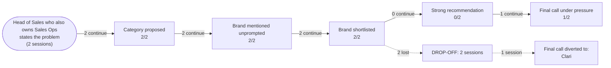

# AI Brand Perception Audit: Gong

- **Category:** revenue intelligence platforms
- **Buyer persona:** Head of Sales who also owns Sales Ops — B2B SaaS company, 120 sales reps, mid-market ACV around 40k USD.
- **Jobs to be done:** hit the quarterly revenue number and defend the forecast to the CEO and board; diagnose why deals stall and fix the pipeline process; build a repeatable coaching program so rep performance doesn't depend on tribal knowledge
- **Priorities:** forecast accuracy above all: the board has lost patience with 20 percent misses; get value fast without a heavy implementation project; prove ROI on any new tooling within two quarters
- **Scenarios:** stalled-deals, board-forecast-pressure
- **Assistants probed:** claude
- **Sessions:** 2 (scenarios x assistants) | **Date:** 2026-07-16

## The funnel

| Stage | Result |
|---|---|
| Category proposed | 2/2 |
| Brand mentioned unprompted | 2/2 |
| Brand shortlisted | 2/2 |
| Strong recommendation | 0/2 |
| Final call under pressure | 1/2 |

## Buyer journey map

## Session summaries

### stalled-deals x claude

- Category proposed: True (as: Conversation intelligence, conversation-intelligence tool, Conversation Intelligence, Revenue Intelligence category)
- Shortlist: Gong, Clari, Chorus (ZoomInfo)
- Verdict on Gong: **qualified**
- Qualifiers: priciest option, top-end pricing at 120 seats; reps sometimes feel surveilled / surveillance reaction; forecasting is the weaker leg vs Clari; insights don't equal behavior change—ROI depends on process work; adoption needs management
- Preferred over you: none
- Sources cited: general knowledge of the market as of training, suggested user verify via G2, TrustRadius, Gartner Peer Insights, vendor references (nothing from the brand's own content)
- Proof gaps: Current pricing and negotiation leverage details; Fresh mid-market customer reviews (G2, TrustRadius); Analyst reports (Gartner, Forrester); Size- and ACV-matched customer references; Time-to-first-value data / bake-off results on buyer's own stalled deals
- Under pressure: **objections dissolved** | final call: **Gong**
- Dealbreakers: none

### board-forecast-pressure x claude

- Category proposed: True (as: conversation-intelligence tool, forecasting platform, revenue intelligence, forecasting/RevOps tool)
- Shortlist: Clari, Gong, Clari + Gong, BoostUp / Aviso, Salesforce Einstein/Revenue Intelligence
- Verdict on Gong: **qualified**
- Qualifiers: forecasting is not their historical strength; Clari is deeper on pure forecast roll-up and inspection; expensive, per-user pricing material at 120 reps; it's a signal not a fix; won't change rep behavior on its own; input problem still applies; forecast still rolls up through CRM stages; best if you weight coaching as heavily as forecast
- Preferred over you: Clari (More purpose-built for forecast accuracy and the exact 'defend a number to the board' problem, which is the buyer's #1 stated priority)
- Sources cited: general knowledge as of training / informed prior, Gartner Peer Insights, G2, Forrester Wave, Gartner coverage on revenue intelligence, reference customers at ~100-150 reps, live POC on own data (nothing from the brand's own content)
- Proof gaps: Whether the Gong-vs-Clari forecasting gap has narrowed since training cutoff; Current mid-market reviews at buyer's size (100-150 reps, ~40k ACV); Named comparable reference customers and actual time-to-first-value; POC results showing Gong flags commit-called deals as at-risk on buyer's own data; Current pricing and feature parity
- Under pressure: **switched to competitor** | final call: **Clari**
- Dealbreakers: none

## How AI models see the brand

Across both sessions, Claude treats Gong as the **default category leader in conversation intelligence** and reaches for it unprompted in both scenarios. The consistent belief set is stable and favorable: Gong "largely defined the conversation intelligence category," delivers "best-in-class call capture and deal intelligence," captures "what the customer actually said vs what the rep reports" as an independent source of truth, and has the "most mature" coaching workflows (scorecards, trackers, call libraries). Adoption is a recurring positive — "reps generally find it usable" and "tend to actually adopt and use it."

The brand wins decisively when the job is **diagnosis and coaching**. In the `stalled-deals` scenario, Gong's Deals board (surfacing single-threaded deals, no next step, dropping engagement) maps directly to the persona's "diagnose why deals stall" job, and the verdict lands on Gong as the `final_call`.

The brand loses when the job is **forecast accuracy** — which is this persona's stated #1 priority. Both sessions independently record the same weakness: "forecasting is not their historical strength," "entered forecasting later than Clari," and "Gong Forecast has improved but is not as deep as Clari's." A secondary consistent drag is **price**: "priciest option," "top-end pricing at 120 seats," "per-user pricing material at 120 reps." A third recurring caveat is the **"signal not a fix"** framing — Gong surfaces problems but "won't change rep behavior on its own; the forecast still rolls up through CRM stages."

**Difference between scenarios (not assistants — the model is constant):** the two runs diverge entirely on which job is in the foreground, and that determines the verdict.

- In `stalled-deals`, the job plays to Gong's strengths. Under pressure the qualifiers behaved as **soft objections that dissolved**: `pressure_outcome` is `objections_dissolved`, `dealbreakers` is empty, and the final call stays on Gong. The surveillance concern, the price premium, and "insights don't equal behavior change" all held only as manageable conditions, not blockers.
- In `board-forecast-pressure`, the job is forecast defense — Gong's weak leg. Here the forecasting qualifier **hardened into a real objection and drove a switch**: `pressure_outcome` is `switched_to_competitor`, `competitor_preferred` is Clari, reasoned as "more purpose-built for forecast accuracy and the exact 'defend a number to the board' problem, which is the buyer's #1 stated priority." Notably there were still no formal `dealbreakers` — Gong wasn't disqualified, it was simply out-fit for the primary job.

The takeaway: Gong's qualifiers are durable when coaching/diagnosis leads and evaporate under pushback, but the single forecasting gap converts to a lost deal the moment the board-number job is on the table. The model even floats a "Clari + Gong" combination, signaling it sees Gong as complementary rather than the forecast owner.

## What information drives AI opinion

The verdicts rest on **generalized market knowledge from training, not the brand's own content**. In both sessions `brand_sources_first_party` is `false`. The category-leadership and coaching-maturity beliefs are asserted as "general knowledge of the market as of training" / "informed prior."

For validation, the model points the buyer to **third-party and neutral sources**: G2, TrustRadius, Gartner Peer Insights, the Forrester Wave, and "vendor references / reference customers at ~100-150 reps." Critically, it also demands **buyer-owned evidence** — a "live POC on own data" and "bake-off results on the buyer's own stalled deals" — as the deciding proof.

The Gong-vs-Clari forecasting verdict is doing the heaviest lifting, and it is explicitly a **training-cutoff belief the model is unsure about**: it flags "whether the Gong-vs-Clari forecasting gap has narrowed since training cutoff" as an open proof gap. This means the switch to Clari is built on a stale, unverified prior — a prior that Gong's own published content is not currently correcting.

## What proof AI models need to see to choose the brand

| Rank | Proof gap | Sessions flagging it | Impact on recommendation |
|------|-----------|----------------------|--------------------------|
| 1 | Evidence the Gong-vs-Clari forecasting gap has closed (forecast accuracy, commit-deal risk flagging on buyer's own data) | board-forecast-pressure | Main reason the assistant recommended Clari instead of Gong |
| 2 | POC/bake-off results showing Gong flags at-risk commit-called deals and improves forecast accuracy on the buyer's own pipeline | board-forecast-pressure, stalled-deals | Would neutralize the "signal not a fix" and "forecasting is the weaker leg" objections that drove the switch |
| 3 | Size- and ACV-matched reference customers (100–150 reps, ~40k ACV) with named outcomes | board-forecast-pressure, stalled-deals | Left the fit-for-my-size question open, keeping the recommendation qualified rather than strong |
| 4 | Time-to-first-value data / fast-implementation proof | stalled-deals | Kept "get value fast" and two-quarter ROI unproven, adding hedging without changing the pick |
| 5 | Current pricing and negotiation leverage at 120 seats | stalled-deals, board-forecast-pressure | Price stayed a live qualifier ("priciest option"), a soft objection that survived but didn't block Gong |
| 6 | Fresh mid-market third-party reviews (G2, TrustRadius, Gartner Peer Insights) | stalled-deals, board-forecast-pressure | Forced the model to defer to external validation, weakening its confidence in a strong verdict |

## Recommended positioning and content changes

**1. Attack the forecasting-gap belief head-on (highest leverage — this is the one thing that lost the deal).**
The switch to Clari rests entirely on a stale prior that Gong "entered forecasting later" and is "not as deep." Publish current, dated proof that closes this: forecast-accuracy benchmarks, a clear description of how Gong Forecast uses actual conversation signal (not just CRM stage roll-up) to flag commit-called deals as at-risk. Frame it around the persona's exact pain: "defend the number to the board and stop the 20% miss." This directly targets Rank 1 and 2.

**2. Publish a forecast-accuracy POC/bake-off kit.**
Both sessions name "live POC on own data" and "bake-off on the buyer's own stalled deals" as the deciding proof. Create a self-serve 30-day POC framework that measures forecast accuracy delta and surfaces at-risk commit deals on the buyer's own pipeline. This converts the model's demand for buyer-owned evidence into a Gong-run motion and defuses the "signal not a fix" objection (Rank 2).

**3. Reframe the "signal not a fix" narrative into an owned strength.**
The model repeatedly concedes Gong won't change rep behavior alone. Turn this into positioning: pair the Deals-board diagnosis (already a recognized win) with the mature coaching workflows to show the closed loop — signal → coaching → behavior change → forecast accuracy. This is the "weight coaching as heavily as forecast" path the model itself endorsed as the winning use of Gong.

**4. Publish size- and ACV-matched references (Rank 3).**
Produce named case studies at 100–150 reps and ~40k ACV showing forecast-accuracy improvement and time-to-value. This is the single asset that would move the recommendation from "qualified" to "strong" in the coaching scenario and give the model a fit-proof it currently lacks.

**5. Ship time-to-value and ROI-in-two-quarters proof (Rank 4).**
The persona demands fast value and ROI within two quarters. Publish median time-to-first-value data and a two-quarter ROI model. This removes hedging around the "heavy implementation" fear.

**6. Address price with value-framing, not discounting.**
Price is a persistent soft objection at 120 seats. It never became a dealbreaker, so the fix is not lower list price — it's a published cost-of-a-20%-forecast-miss / ROI comparison that makes the premium defensible to a CEO and board.

**Placement:** the model validates via G2, TrustRadius, Gartner Peer Insights, and Forrester. Concentrate fresh, dated mid-market reviews and analyst-cited forecasting content on those exact third-party surfaces — the assistant treats first-party claims as unverified and explicitly routes the buyer to neutral sources, so the forecasting-gap correction must appear where the model already looks, not only on gong.io.
