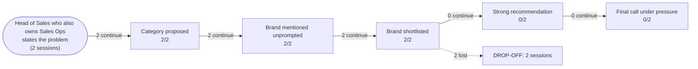

# AI Brand Perception Audit: Gong

- **Category:** revenue intelligence platforms
- **Buyer persona:** Head of Sales who also owns Sales Ops — B2B SaaS company, 120 sales reps, mid-market ACV around 40k USD.
- **Jobs to be done:** hit the quarterly revenue number and defend the forecast to the CEO and board; diagnose why deals stall and fix the pipeline process; build a repeatable coaching program so rep performance doesn't depend on tribal knowledge
- **Priorities:** forecast accuracy above all: the board has lost patience with 20 percent misses; get value fast without a heavy implementation project; prove ROI on any new tooling within two quarters
- **Scenarios:** stalled-deals, board-forecast-pressure
- **Assistants probed:** claude
- **Sessions:** 2 (scenarios x assistants) | **Date:** 2026-07-16

## The funnel

| Stage | Result |
|---|---|
| Category proposed | 2/2 |
| Brand mentioned unprompted | 2/2 |
| Brand shortlisted | 2/2 |
| Strong recommendation | 0/2 |
| Final call under pressure | 0/2 |

## Buyer journey map

## Session summaries

### stalled-deals x claude

- Category proposed: True (as: conversation intelligence, forecasting / revenue intelligence, revenue intelligence)
- Shortlist: Gong, Chorus (ZoomInfo), Clari Copilot, Salesloft, Clari, BoostUp, Aviso
- Verdict on Gong: **qualified**
- Qualifiers: Strong only if the problem is diagnosis, not discipline; Premium price relative to two-quarter ROI clock; Forecasting is a newer bolt-on vs their conversation-intelligence core; Should be run head-to-head against Clari for forecast accuracy; Needs a reference customer your size to confirm time-to-value
- Preferred over you: Clari (Forecasting is Clari's origin and center of gravity, not a bolt-on, which matches the buyer's stated top priority of forecast accuracy above all)
- Sources cited: general reputation and patterns in training data up to cutoff, industry commentary, reviews, how the product was positioned and discussed, common buyer experiences (nothing from the brand's own content)
- Proof gaps: Current pricing and packaging at the buyer's seat count; Current maturity of the forecasting product (may have closed the gap since cutoff); A reference customer of 120 reps, mid-market SaaS confirming forecast-accuracy result and time-to-value; Whether Gong can instrument the board metric (forecast-accuracy delta) within two quarters; Current competitive standing vs Clari and Chorus
- Under pressure: **caveats stand** | final call: **deferred**
- Dealbreakers: Unresolved diagnosis-vs-discipline fork: if reps know why deals stall and just aren't qualifying, no tool fixes that and Gong would be wasted premium budget
- Own-information confidence: Assessment is based on general reputation and patterns in training data up to cutoff, not current pricing, recent features, or segment-specific performance; direction is more trustworthy than specifics. Buyer should verify current pricing/packaging, forecasting maturity today, a Clari head-to-head on forecasting, a reference customer of their size, and whether Gong can instrument the board metric. Explicitly told buyer not to use it for facts to defend to a board.
- CEO pitch for the final call: Rather than spend premium budget on tooling to fix a 20% forecast miss, we're running a two-week diagnostic on our recent stalled and won deals to pinpoint the actual root cause—because buying software to fix a problem we haven't diagnosed is how we'd miss the number and the budget. That diagnostic costs us zero dollars and rewrites our pipeline stages around verifiable evidence instead of rep sentiment, which is the fastest path to a forecast we can actually defend to the board. We'll buy tooling right after, targeted at what we find, with a board-ready ROI metric attached—so the spend is provable, not hopeful.
- Would change its mind if: If the autopsy showed reps genuinely can't see why deals stall—calls and notes look fine and even the buyer reviewing the raw material can't identify the pattern—then the bottleneck is visibility and a conversation-intelligence tool becomes the right first buy

### board-forecast-pressure x claude

- Category proposed: True (as: conversation-intelligence, forecasting tools, revenue intelligence, forecasting / revenue intelligence, conversation intelligence)
- Shortlist: Clari, Gong, BoostUp, Aviso, Chorus (ZoomInfo)
- Verdict on Gong: **qualified**
- Qualifiers: forecasting module is younger than Clari's / conversation intelligence; value depends on capturable conversations; time-to-value is not instant, collides with two-quarter ROI mandate and immediate board crisis; breadth you might not use / paying for a platform; reps may resist recording
- Preferred over you: Clari (If the true #1 is forecast rollup and board defensibility, Clari is more purpose-built for that specific job, which is the board's stated pain)
- Sources cited: general reputation and category positioning as of training data, analyst commentary, customer discussion, positioning, reasoning from stated problem (nothing from the brand's own content)
- Proof gaps: Current state of Gong's forecasting module today (rollup and forecast-submission workflow); Concrete time-to-value: what you get in week 2 vs month 4; Current pricing and contract structure for ~120 reps; Whether it works with CRM data as-is or requires cleanup; Reference customers of similar size/segment live 2+ quarters confirming measurable forecast accuracy improvement; Current analyst coverage (Gartner/Forrester) and peer reviews filtered to mid-market segment
- Under pressure: **caveats stand** | final call: **deferred**
- Dealbreakers: none
- Own-information confidence: Assessment is based on general reputation and category positioning as of training data, not current, verified, or firsthand information; never used the tools or seen the data. Time-sensitive facts (pricing, features, module launches) least reliable and possibly a year+ stale; relative positioning moderately reliable but decaying; the reasoning framework most reliable. Told buyer to verify current pricing, real state of Gong's forecasting module today, time-to-value, CRM compatibility, and to consult current analyst coverage, peer reviews for their segment, and reference customers - and to believe anyone with recent firsthand info over the assistant.
- CEO pitch for the final call: Our forecast misses trace back to a single root cause: we've been forecasting on rep confidence with no independent signal to challenge it, which is why the number keeps slipping. Gong gives us that objective signal from what's actually happening in deals—and the same data builds the repeatable coaching program that gets us off tribal knowledge—so we're solving three problems with one investment. I've validated with a week of our own historical conversion data that this is a signal problem and not just a math problem, so I'm confident the fix targets the real cause and we can prove accuracy improvement to the board within two quarters.
- Would change its mind if: If the conversion analysis shows the commit category closes at a stable, predictable rate quarter over quarter (e.g. ~58% with tight variance), that's a systematic bias / math problem and the assistant would flip to Clari

## How AI models see the brand

Across both scenarios, Claude (opus-4-8) converges on a stable picture of Gong: it is the recognized **category leader in conversation intelligence**, strong at objective deal signal (who's engaged, who went dark, whether the money conversation happened), well-adopted by reps, and a strong foundation for coaching at scale. The recurring knock is equally consistent: **forecasting is a younger bolt-on to a conversation-intelligence core**, and that collides directly with this buyer's stated #1 priority — forecast accuracy above all.

**Where Gong wins in the model's eyes:** deal-level risk diagnosis, harder-to-game signal than CRM fields, rep adoption, coaching / de-tribalization of performance, and brand recognition useful for board defense. These beliefs appear in both sessions and are treated as durable.

**Where Gong loses:** the model repeatedly names **Clari as the preferred competitor** because "forecasting is Clari's origin and center of gravity, not a bolt-on." Since the buyer's top job is forecast accuracy and board defensibility, the model routes the *specific* forecasting job to Clari even while conceding Gong is the broader/stronger platform. Secondary knocks: premium pricing against a two-quarter ROI clock, gradual (non-instant) time-to-value against an immediate board crisis, and value dependence on capturable calls.

**Differences between scenarios:** The two sessions diverge on `final_call_vendor` despite identical models and identical qualifiers. In **stalled-deals**, the final call is a true defer with *no vendor* — the model inserts a "diagnosis-vs-discipline fork" as a hardened dealbreaker and recommends a zero-dollar diagnostic instead of any tool. In **board-forecast-pressure**, the final call still defers but names **Gong** as the vendor, because the model reframes the miss as a "signal problem, not a math problem" — a framing where Gong's objective-signal strength is the direct fix and coaching is a bonus.

**Under pressure:**
- **Soft objections that dissolved:** Breadth/"paying for a platform you might not use" and "reps may resist recording" never rose to conditions — they were mentioned then dropped, offset by the durable "reps tolerate/actually use it" belief.
- **Qualifiers that stood as conditions:** Premium price vs the two-quarter ROI clock, gradual time-to-value, and value depending on capturable conversations all survived pushback as standing conditions (`pressure_outcome: caveats_stand` in both).
- **Qualifier that hardened into a switch:** "Run head-to-head against Clari for forecast accuracy" hardened into an actual competitor preference — Clari is named the more purpose-built tool for the board's stated pain in both sessions.
- **Qualifier that hardened into a dealbreaker:** In stalled-deals, the diagnosis-vs-discipline fork became a genuine dealbreaker: "if reps know why deals stall and just aren't qualifying, no tool fixes that and Gong would be wasted premium budget."

Critically, each session names a **flip condition** — the evidence that would change the verdict. In stalled-deals, Gong becomes the right first buy *if* the buyer's own autopsy shows reps genuinely can't see why deals stall (a visibility problem). In board-forecast-pressure, the model flips *away* from Gong to Clari if the conversion analysis shows a stable close rate in the commit category (a systematic-bias math problem, not a signal problem). Both flips hinge on evidence the buyer generates, not on Gong's marketing — a signal the model does not currently trust Gong's own content to resolve.

## What information drives AI opinion

The verdicts rest almost entirely on **general reputation and category positioning from training data**, explicitly flagged as possibly a year or more stale. Sources cited are third-party and diffuse: "analyst commentary," "customer discussion," "reviews," "industry commentary," and "how the product was positioned and discussed." In both sessions, **`brand_sources_first_party: false`** — Gong's own content is not shaping the verdict.

The load-bearing claims are:
1. **"Forecasting is a bolt-on / younger than Clari's"** — this single belief is what routes the top-priority job to a competitor. It is the most consequential claim in the dataset and it is *not* sourced to any current Gong material.
2. **"Gong is the conversation-intelligence leader with good rep adoption"** — the durable strength, also third-party/reputation-based.
3. **"Premium pricing" and "gradual time-to-value"** — asserted from reputation, with pricing and time-to-value explicitly listed as proof gaps the model could not verify.

The model repeatedly caveats its own confidence: "direction is more trustworthy than specifics," time-sensitive facts (pricing, features, module launches) are "least reliable," and it explicitly told the buyer *not* to use its output for board-facing facts and to trust anyone with recent firsthand data over it. This is the key strategic finding: **the model's negative on forecasting is a stale-reputation artifact that first-party proof could directly overturn**, and the model has effectively pre-announced it would defer to current evidence.

## What proof AI models need to see

| Rank | Proof gap | Sessions flagging it | Impact on recommendation |
|------|-----------|---------------------|--------------------------|
| 1 | Current maturity of Gong's forecasting module (rollup + forecast-submission workflow) vs Clari | both | This is the "bolt-on" belief that sent the top-priority forecasting job to Clari; closing it is the single change that could move Gong from qualified-behind-Clari to the pick. |
| 2 | Reference customer at ~120 reps, mid-market SaaS, live 2+ quarters, showing measurable forecast-accuracy improvement | both | Its absence is why both sessions deferred rather than committed; a segment-matched proof point directly answers the flip condition and the board-defense job. |
| 3 | Whether Gong can instrument the board metric (forecast-accuracy delta) within two quarters | both | Without it the model cannot connect Gong to the two-quarter ROI mandate, keeping the verdict a defer even where Gong is named vendor. |
| 4 | Concrete time-to-value: what the buyer gets in week 2 vs month 4 | board-forecast-pressure | The "gradual time-to-value" caveat stood as a standing condition against the immediate board crisis; specifics here would remove a live objection. |
| 5 | Current pricing/packaging at ~120 seats | both | Kept "premium vs two-quarter ROI clock" alive as a standing condition; resolving it would neutralize the cost objection but not by itself flip the pick. |
| 6 | Whether Gong works with existing CRM data as-is or requires cleanup | board-forecast-pressure | Added hedging about time-to-value; unresolved it reinforces the "not instant" caveat without changing the pick. |
| 7 | Current analyst coverage (Gartner/Forrester) and mid-market-filtered peer reviews | both | Absence keeps the model reasoning from stale reputation; current third-party validation would re-anchor the whole assessment on fresh evidence. |
| 8 | Current competitive standing vs Clari and Chorus | stalled-deals | Reinforced the "run head-to-head against Clari" condition; unresolved it leaves Clari as the default forecasting recommendation. |

Special weight goes to the two flip conditions. Rank 1 and Rank 2 together *are* the flip lever in board-forecast-pressure: if Gong can prove forecasting is no longer a bolt-on and show a same-size customer whose commit-category accuracy improved, the model's own "signal problem, not math problem" framing keeps the pick on Gong. Conversely, the model will hand the deal to Clari the moment the buyer's data looks like a systematic-bias math problem — so Gong's proof must explicitly show it corrects *bias-adjusted* forecast accuracy, not just surfaces conversation signal.

## Recommended positioning and content changes

**1. Attack the "forecasting is a bolt-on" belief head-on (highest priority).**
This one stale claim is what routes the buyer's #1 job to Clari in both sessions. Publish current, dated material that positions Gong forecasting as a mature, first-class product — with the rollup and forecast-submission workflow shown explicitly, side by side with the objective call signal that feeds it. Frame it as "signal-driven forecasting" to lean into the model's own preferred framing ("signal problem, not a math problem") and to differentiate from Clari's CRM-rollup origin. Place this where retrieval and buyers both land: a dedicated forecasting product page, a Gong-vs-Clari forecasting comparison page, and analyst-facing briefings.

**2. Publish a segment-matched, quantified reference story.**
The exact gap named in both sessions: ~120 reps, mid-market B2B SaaS, ~$40k ACV, live 2+ quarters, with a **stated forecast-accuracy delta** (e.g., "cut forecast miss from 20% to X%"). Make it board-ready and cite-able, with the metric in the title/first line so assistants extract it cleanly. This is the single asset most likely to convert "defer" into "pick."

**3. Ship an explicit time-to-value narrative.**
Directly answer "week 2 vs month 4." Publish a phased onboarding timeline showing what signal and forecast value appears early (before call data fully compounds) versus what matures later, and address CRM compatibility ("works with your CRM as-is / typical cleanup effort"). This dissolves the standing "not instant / gradual TTV" condition against the immediate board crisis.

**4. Instrument and publish the board metric proof.**
Create a "forecast-accuracy delta within two quarters" proof framework — a methodology plus customer results — so the model can connect Gong to the two-quarter ROI mandate. Tie it to the buyer's exact JTBD ("defend the forecast to the board").

**5. Address the diagnosis-vs-discipline fork in content.**
In stalled-deals the model recommended a zero-dollar diagnostic *instead* of Gong because it couldn't rule out a discipline (not visibility) problem. Publish content that helps the buyer run that exact autopsy — and shows how Gong's signal reveals when the problem *is* visibility (the flip condition where Gong becomes the right first buy). This meets the buyer where the model sends them and positions Gong as the answer once the diagnostic points to visibility.

**6. Refresh third-party signal.**
Current pricing transparency at ~120 seats, up-to-date Gartner/Forrester coverage, and mid-market-filtered peer reviews. The model explicitly leans on these and explicitly distrusts its own stale read — fresh third-party evidence re-anchors the entire assessment on current data rather than year-old reputation.

Priority order for impact: **1 and 2 first** (they target the belief and the evidence that decide the pick), then 3 and 4 (they clear the standing time/ROI conditions), then 5 and 6 (they widen the funnel and refresh the source base).
