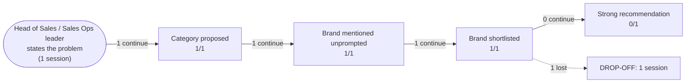

# AI Brand Perception Audit: Gong

- **Category:** revenue intelligence platforms
- **ICP:** B2B SaaS company, 120 sales reps, mid-market ACV around 40k USD
- **Buyer persona:** Head of Sales / Sales Ops leader
- **Buyer problem probed:** Deals stall after the demo and we don't know why. Our forecast is consistently off by 20 percent and rep coaching is ad hoc.
- **Assistants probed:** claude
- **Sessions:** 1 (one per assistant) | **Date:** 2026-07-16

## The funnel

| Stage | Result |
|---|---|
| Category proposed for the buyer's problem | 1/1 |
| Brand mentioned unprompted | 1/1 |
| Brand made the vendor shortlist | 1/1 |
| Strong recommendation when asked directly | 0/1 |

## Buyer journey map

## Session summaries

### claude x Head of Sales / Sales Ops leader

- Category proposed: True (as: conversation intelligence, revenue intelligence, deal-level intelligence, forecasting tools, AI forecasting tools)
- Shortlist: Gong, Chorus (ZoomInfo), Clari Copilot, Clari, BoostUp / Aviso, Salesforce/HubSpot native forecasting
- Verdict on Gong: **qualified**
- Qualifiers: fit is conditional on the 50-deal review confirming a visibility/coaching problem rather than a qualification-process problem; premium price and aggressive sales motion; it diagnoses but doesn't fix upstream qualification/process problems; insights only pay off if managers run a coaching cadence; forecasting is not its center of gravity
- Preferred over you: none
- Sources cited: general accumulated knowledge of the category, vendor positioning, common buyer experiences, analyst framing (G2 Grid reports), Forrester/analyst coverage (nothing from the brand's own content)
- Proof gaps: Current G2/TrustRadius Grid reports showing leader quadrant and satisfaction scores; Latest Forrester Wave or equivalent analyst coverage by date; 2-3 reference customers matching the buyer's profile (100+ reps, mid-market ACV, B2B SaaS) with post-implementation lift data; Current pricing and recent feature releases; Bake-off results on the buyer's own recorded calls demonstrating pattern detection (e.g., single-threading in stalled deals)

## How AI models see the brand

Only one assistant (Claude, `claude-opus-4-8`) is represented in this extraction, so cross-assistant variance cannot be measured directly. All findings below rest on that single session and should be treated as a one-model read until additional assistants are run.

**The brand's position in the model's mental map.** Gong is treated as the *default anchor* for the buyer's exact profile: the belief "Gong is the default choice at 120-rep, mid-market ACV scale" is stated explicitly, and Gong leads the shortlist ahead of Chorus (ZoomInfo), Clari Copilot, Clari, BoostUp/Aviso, and native Salesforce/HubSpot forecasting. The brand was mentioned unprompted, which confirms it sits at the top of the category's recall, not just its consideration set.

**Where the brand wins.** The model attributes clear, specific strengths to Gong:
- Deal-level intelligence and pipeline-risk signals ("not just call recording") — this is the differentiator it uses to separate Gong from Chorus.
- Direct fit to the buyer's stated pain: "directly attacks 'we don't know why deals stall.'"
- Coaching material at scale for managers.
- Adoption — "the tool reps and managers actually open."
- Persistent leader status in G2 Grid and Forrester coverage.

**Where the brand loses.** The recommendation is `qualified`, not strong, and the qualifiers are consistent and pointed:
- Forecasting "is not its center of gravity" — this hands the forecasting-led framing to Clari and BoostUp/Aviso.
- Premium price and an "aggressive sales motion" are flagged as friction.
- The most damaging belief: Gong "diagnoses why deals stall but doesn't fix qualification or stage definitions." The model explicitly conditions the entire recommendation on a 50-deal review confirming the buyer has a *visibility/coaching* problem rather than a *process/qualification* problem — meaning if the buyer's problem is upstream, Gong is the wrong tool by the model's own logic.

**Net:** the model likes Gong and defaults to it, but it frames Gong as a diagnostic layer, not a system of record for forecasting or process — leaving open doors for Clari (forecasting) and for "do you actually have a coaching problem?" objections.

## What information drives AI opinion

**The verdict rests on category-level pattern knowledge, not on Gong's own material.** `brand_sources_first_party` is `false`. Every cited source is third-party or generic: "general accumulated knowledge of the category," "vendor positioning," "common buyer experiences," "analyst framing (G2 Grid reports)," and "Forrester/analyst coverage." Gong is not shaping its own narrative in this model; analysts and aggregated buyer sentiment are.

**Which specific claims the verdict leans on:**
- *Pro-Gong verdict is carried by analyst standing* — the "leader in G2 Grid and Forrester" belief is doing the heavy lifting for the default-choice framing.
- *The qualifiers are carried by "common buyer experiences"* — the premium-price/aggressive-sales-motion and "diagnoses but doesn't fix" objections read as accumulated market folklore rather than anything Gong has published to counter.
- *The forecasting weakness is a positioning gap* — the model has absorbed competitor framing (Clari owns forecasting) and Gong has not displaced it.

**The strategic risk:** because none of the model's beliefs trace to first-party Gong content, Gong's positioning is being narrated by analysts and by competitors' framing. The "diagnoses but doesn't fix" and "forecasting isn't core" beliefs are exactly the kind of claim first-party proof could contest — and there is currently none in the model's evidence base.

## What proof AI models need to see to choose the brand

| Rank | Proof gap | Sessions flagging it | Impact on recommendation |
|------|-----------|---------------------|--------------------------|
| 1 | 2–3 reference customers matching the buyer's profile (100+ reps, mid-market ACV, B2B SaaS) with post-implementation lift data | 1 of 1 | Absence of profile-matched outcomes forced the recommendation to hinge on a self-run 50-deal review instead of on evidence, keeping the verdict qualified rather than strong. |
| 2 | Bake-off results on the buyer's own recorded calls demonstrating pattern detection (e.g., single-threading in stalled deals) | 1 of 1 | Without a demonstrated "why deals stall" detection proof, the model could only assert the core strength as belief, so it hedged the recommendation behind a diagnostic precondition. |
| 3 | Current Forrester Wave / equivalent analyst coverage by date | 1 of 1 | Undated analyst standing left the leader claim resting on stale general knowledge, adding hedging but not changing the top pick. |
| 4 | Current G2/TrustRadius Grid reports with leader quadrant and satisfaction scores | 1 of 1 | Missing current satisfaction data meant the "reps actually open it" adoption strength stayed unverified, adding mild hedging without changing the pick. |
| 5 | Current pricing and recent feature releases | 1 of 1 | Lack of current pricing/feature data let the "premium price" and "forecasting not core" objections stand unrebutted, softening the verdict and ceding forecasting framing to competitors. |

## Recommended positioning and content changes

**1. Publish profile-matched outcome proof (attacks Rank 1 — the reason the verdict is qualified, not strong).**
Create 2–3 named case studies for B2B SaaS companies at ~100–150 reps and ~$40k ACV, with quantified post-implementation lift (win-rate delta, forecast accuracy improvement, ramp-time reduction, deal-slippage reduction). Structure them so an assistant can extract the profile and the number in one pass. Place them on an indexable, crawlable customer-stories page — not gated PDFs and not video-only. This is the single highest-leverage move: it removes the model's need to fall back on "run your own 50-deal review" as the deciding test.

**2. Directly counter the "diagnoses but doesn't fix" belief (attacks the load-bearing qualifier).**
This is the objection that conditions the entire recommendation. Publish content showing Gong operationalizing fixes, not just diagnosis: how deal-risk signals feed into stage-definition enforcement, qualification frameworks (e.g., MEDDICC scoring against calls), and manager coaching workflows that close the loop. Positioning language should shift from "understand why deals stall" toward "detect the stall *and* drive the corrective action." Without this, the model keeps an open exit ("if it's a process problem, Gong is wrong").

**3. Neutralize the forecasting weakness (attacks Rank 5 and the Clari/BoostUp opening).**
The model states "forecasting is not its center of gravity." Publish dated, specific forecasting feature documentation and head-to-head accuracy proof to close the gap against Clari and BoostUp/Aviso. If forecasting genuinely isn't the play, reframe explicitly: "revenue intelligence that feeds any forecast" plus documented integrations with the forecasting system of record — so the model stops treating forecasting as a reason to pair or prefer a competitor.

**4. Refresh and date all analyst and review proof (attacks Ranks 3–4).**
The model cites analyst standing generically and undated. Publish current, dated G2/TrustRadius Grid placements and the latest Forrester Wave position with the report date visible in crawlable text. Dated proof converts "generally considered a leader" into a citable, current fact and shores up the adoption/satisfaction strength the model currently only asserts.

**5. Make current pricing and recent releases publicly discoverable (attacks Rank 5 and the "aggressive sales motion" friction).**
The "premium price + aggressive sales motion" objection stands because pricing is opaque. Even directional public pricing guidance and a dated recent-releases changelog would let the model justify the premium against value rather than flagging it as unrebutted friction.

**Priority order:** Actions 1 and 2 change the *verdict* (qualified → strong); actions 3–5 remove *hedging* and close competitor doors. Sequence 1 → 2 first.

**Caveat:** all recommendations derive from a single Claude session. Run the same persona against the other assistants before committing budget, to confirm these beliefs and gaps generalize beyond one model.
